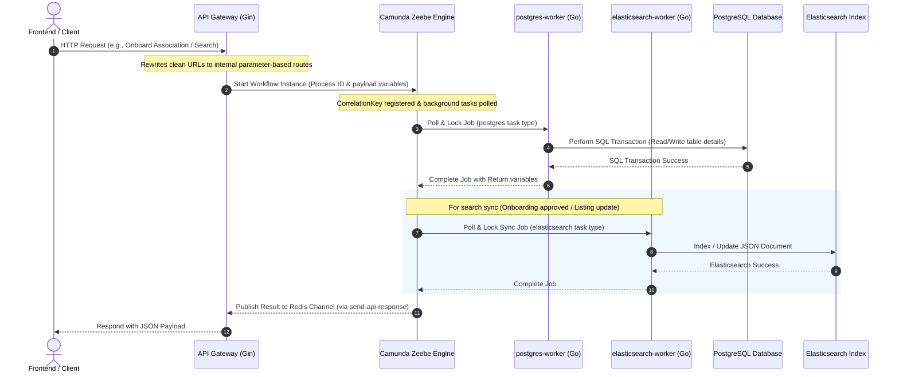
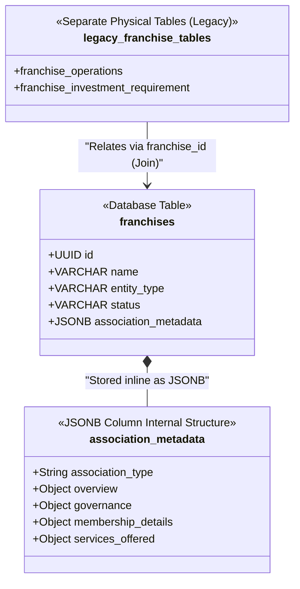
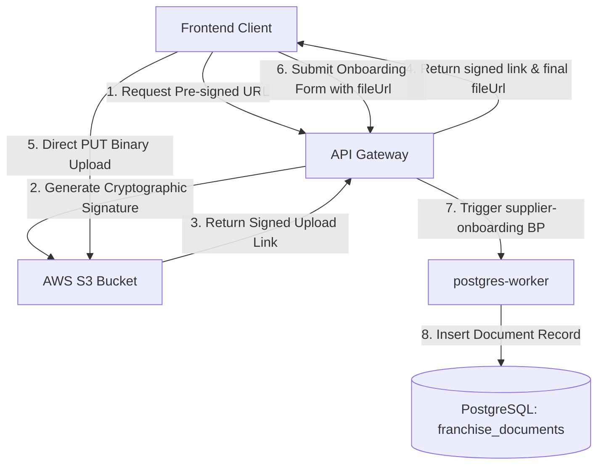
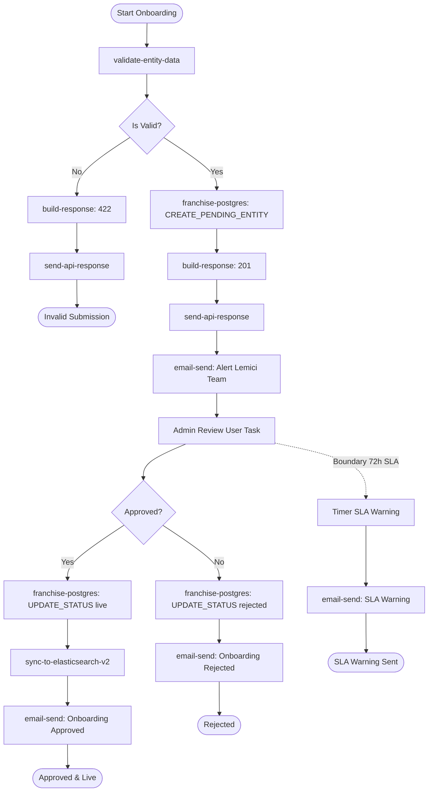
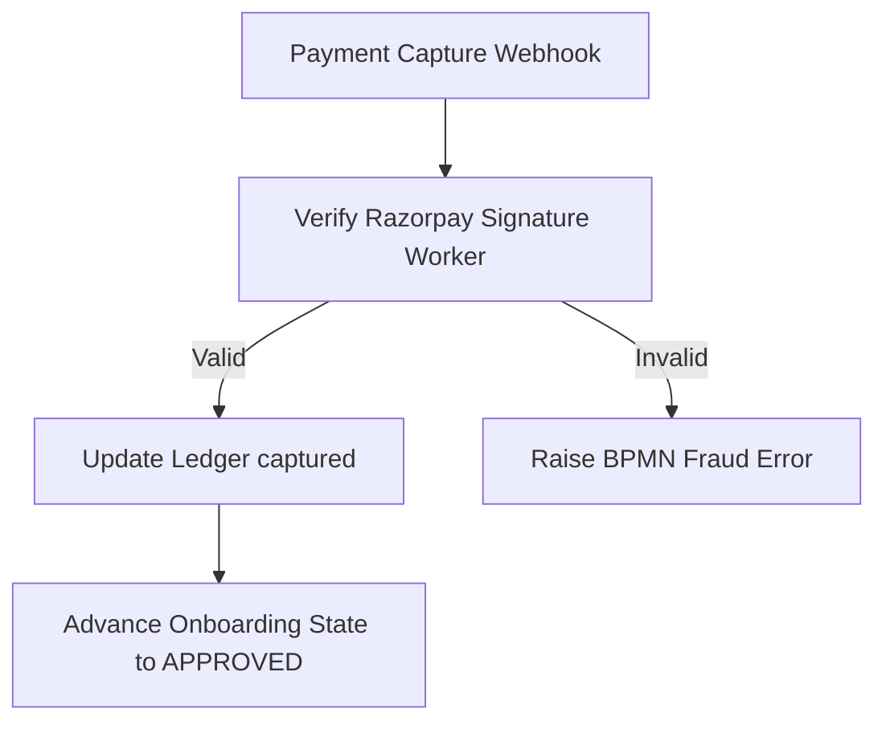

# LeMiCi Association Module: Technical Architecture & Integration Guide

This document serves as the master engineering and integration guide for the **Association Module** of the LeMiCi platform. It explains the system's runtime architecture, details the architectural differences between the legacy Franchise system and the new Association system, and specifies how the module integrates into the existing codebase without breaking backward compatibility.

---

## 1. System Architecture & Conceptual Flow

The LeMiCi Association module operates on a **microservices-supported workflow architecture** driven by **Camunda Zeebe v8**. 

### 1.1 Black-Box Architecture Flow
The following diagram illustrates how a client request interacts with the API Gateway, Camunda engine, backend workers, and persistent layers:



---

## 2. Key Differences: Association vs. Legacy Franchise System

Although the two entities exist within the same codebase, their underlying database design, document handling, and query patterns are separated to optimize scalability.

### 2.1 Database Storage Model: Relational vs. Dynamic JSONB
To avoid schema bloat, both entities are stored in the main `franchises` table but leverage different relational properties:



#### Detailed Comparison Table:
| Structural Dimension | Existing Franchise System | New Association System |
| :--- | :--- | :--- |
| **Entity Table** | `franchises` (where `entity_type = 'franchise'`) | `franchises` (where `entity_type = 'association'`) |
| **Relational Data** | Split across auxiliary normalized tables (`franchise_operations`, `franchise_investment_requirement`, etc.) | **Self-contained** inside a single `association_metadata` JSONB column. |
| **Category/Taxonomy** | Normalized `franchise_categories` junction table mapping to static categories. | Nested within `association_metadata.membership_details.categories` + metadata attributes. |
| **Key Metadata Fields** | Stored in structured DB columns (e.g. `total_outlets`, `units_count`). | Dynamically accessed inside `association_metadata` (e.g. `regional_structure.jurisdiction`). |

---

### 2.2 Document Storage and Upload Workflow
In the legacy system, uploaded documents were stored as unstructured text inside the primary table. The new Association system introduces a secure **serverless file upload architecture**:



* **Relational Security:** All uploaded documents are written to a dedicated `franchise_documents` table with status trackers (`pending`, `verified`, `rejected`), ensuring no file links exist inside general JSONB metadata.

---

### 2.3 API Route Separation
To present clean SEO-friendly URLs while utilizing Gin's prefix matching:
* **Franchise APIs:** Handled via routing patterns mapped under `/api/v1/franchises/...`.
* **Association APIs:** Dynamically rewritten in the gateway to `/api/v1/entities/association/...` allowing clean frontend URLs like `/api/v1/association/home`.

---

## 3. BPMN Workflow & Zeebe Workers Specification

The system manages the lifetime of both systems through decoupled **Zeebe Job Workers** registered in the `worker-manager` service.

### 3.1 Onboarding Workflow (`supplier-onboarding.bpmn`)
This process manages new registrations, document tracking, and validation checks:

* **Process ID:** `supplier-onboarding`
* **Version:** `2.0.0`
* **Tasks & Workers Mapping:**



---

### 3.2 Individual Zeebe Workers Specifications

#### 1. Postgres Worker (`franchise-postgres`)
* **Package Path:** `internal/workers/data-access/franchise-postgres`
* **Job Type (Zeebe Task Name):** `franchise-postgres`
* **Input Parameters:**
```json
{
  "operation_type": "String [CREATE_PENDING_ENTITY | UPDATE_STATUS | GET_FULL_FRANCHISE]",
  "entityType": "String [franchise | association]",
  "formData": {
    "associationName": "String",
    "contactEmail": "String",
    "memberCount": "Float64 (Optional)",
    "documents": [
      { "type": "String", "url": "String" }
    ]
  }
}
```
* **Output Parameters:**
```json
{
  "success": "Boolean",
  "franchiseId": "String (UUID)",
  "message": "String"
}
```

#### 2. Elasticsearch Query Worker (`query-elasticsearch`)
* **Package Path:** `internal/workers/data-access/query-elasticsearch`
* **Job Type (Zeebe Task Name):** `query-elasticsearch`
* **Input Parameters:**
```json
{
  "queryType": "String [SEARCH_WITH_FILTERS | ES_HERO_BRANDS | ES_POPULAR_LISTINGS]",
  "entityType": "String [franchise | association]",
  "params": {
    "query": "String",
    "location": "String",
    "minFee": "Float64",
    "maxFee": "Float64"
  },
  "pagination": { "from": 0, "size": 20 }
}
```
* **Output Parameters:**
```json
{
  "success": "Boolean",
  "data": "Array of Indexed Objects",
  "total": "Int64"
}
```

#### 3. Email Notification Worker (`email-send`)
* **Package Path:** `internal/workers/communication/email-send`
* **Job Type (Zeebe Task Name):** `email-send`
* **Worker Version:** `v1.1.0`
* **Input Parameters:**
```json
{
  "templateId": "String (e.g., 'admin_new_association_alert')",
  "recipientEmail": "String",
  "variables": {
    "entityName": "String",
    "status": "String"
  }
}
```
* **Output Parameters:**
```json
{
  "success": "Boolean",
  "messageId": "String"
}
```

#### 4. Elasticsearch Sync Worker (`sync-to-elasticsearch-v2`)
* **Package Path:** `internal/workers/data-access/sync-to-elasticsearch-v2`
* **Job Type (Zeebe Task Name):** `sync-to-elasticsearch-v2`
* **Worker Version:** `v2.0.0`
* **Input Parameters:**
```json
{
  "entityId": "String (UUID)",
  "entityType": "String [franchise | association]",
  "action": "String [INDEX | DELETE]"
}
```
* **Output Parameters:**
```json
{
  "success": "Boolean",
  "indexedId": "String"
}
```

#### 5. Enquiry Validation Worker (`validate-enquiry-data`)
* **Package Path:** `internal/workers/application/validate-enquiry-data`
* **Job Type (Zeebe Task Name):** `validate-enquiry-data`
* **Worker Version:** `v2.0.0`
* **Input Parameters:**
```json
{
  "entityType": "String [franchise | association]",
  "formData": {
    "preferredState": "String (Optional/Franchise-only)",
    "approximateInvestmentBudget": "String (Optional/Franchise-only)",
    "entityName": "String",
    "contactEmail": "String"
  }
}
```
* **Output Parameters:**
```json
{
  "success": "Boolean",
  "validationErrors": "Array of Strings"
}
```
* **Polymorphic Rule Handling:** Bypasses franchise-specific fields (`preferredState`, `approximateInvestmentBudget`) if `entityType` is `"association"`.

#### 6. Record Saving Worker (`create-application-record`)
* **Package Path:** `internal/workers/application/create-application-record`
* **Job Type (Zeebe Task Name):** `create-application-record`
* **Worker Version:** `v2.0.0`
* **Input Parameters:**
```json
{
  "entityType": "String [franchise | association]",
  "entityId": "String (UUID)",
  "userId": "String (UUID)",
  "message": "String",
  "preferredContact": "String [EMAIL | PHONE | EITHER]"
}
```
* **Output Parameters:**
```json
{
  "success": "Boolean",
  "enquiryId": "String (UUID)"
}
```
* **Polymorphic Database Target:** Rewrites traditional application submission to target the new polymorphic `enquiries` table. Enforces duplicates pending validation (`BR-03`) and maximum limit limits (`BR-02`) per user-entity pair. Writes event-level logs to `enquiry_audit_log`.

### 3.3 Worker Deployment Configurations
All Camunda workers defined above share the following baseline configurations via the central Worker Manager:
* **MaxJobsActive:** `32` (determines how many tasks the worker handles concurrently)
* **Timeout:** `30s` (timeout before Zeebe releases the lock to another worker instance)
* **Concurrency:** Fully asynchronous using Go routines, scaled horizontally.

---

## 4. Database Schema Specification

All schema modifications are managed via SQL migration scripts in `deployments/docker/postgres/`.

### 4.1 Existing vs. New Database Schema Fields (table: `franchises`)
To leverage the same table, we repurpose existing columns and add specific fields to manage Association-specific metadata and filtering:

| Column Name | Status | Type | Purpose for Franchises | Purpose for Associations |
| :--- | :--- | :--- | :--- | :--- |
| `id` | **Existing** | UUID | Primary Key | Primary Key |
| `name` | **Existing** | VARCHAR | Name of Franchise | Name of Association |
| `slug` | **Existing** | VARCHAR | URL slug | URL slug |
| `description` | **Existing** | TEXT | Long description | Detailed description / About |
| `founded_year` | **Existing** | SMALLINT | Year established | Year established |
| `contact_email` | **Existing** | VARCHAR | Contact person email | Official email of Association |
| `logo_url_circle` | **Existing** | VARCHAR | Circle Logo URL | Circle Logo URL |
| `logo_url_square` | **Existing** | VARCHAR | Square Logo URL | Square Logo URL |
| `entity_type` | **NEW** | VARCHAR | Set to `'franchise'` | Set to `'association'` (Filters listings and queries) |
| `status` | **NEW** | VARCHAR | Tracks approval status | Tracks approval status |
| `association_metadata` | **NEW** | JSONB | Ignored / Default `{}` | Holds complete dynamic metadata JSONB |
| `member_count` | **NEW** | INT | Ignored / Default `0` | Member count (used for search and sorting) |
| `membership_fee_min` | **NEW** | NUMERIC | Ignored / Default `0.00` | Minimum subscription fee |
| `membership_fee_max` | **NEW** | NUMERIC | Ignored / Default `0.00` | Maximum subscription fee |
| `approved_at` | **NEW** | TIMESTAMP | Approval timestamp | Approval timestamp |

---

### 4.2 Association Metadata JSON Schema (`association_metadata` column)
Below is the full JSON structure stored inside the `association_metadata` column for associations:

```json
{
  "association_type": "String (e.g., National / State / Regional / International)",
  "overview": {
    "about": "String",
    "mission": "String",
    "vision": "String",
    "objectives": ["String"],
    "key_functions": ["String"]
  },
  "governance": {
    "president": { "name": "String", "company": "String", "image_url": "String (Optional)" },
    "vice_presidents": [ { "name": "String", "company": "String", "image_url": "String (Optional)" } ],
    "secretary_general": { "name": "String", "company": "String", "image_url": "String (Optional)" },
    "treasurer": { "name": "String", "company": "String", "image_url": "String (Optional)" },
    "governing_council_members": [ { "name": "String", "company": "String", "role": "String" } ],
    "advisory_board": [ { "name": "String", "company": "String", "role": "String" } ],
    "past_presidents": [ { "name": "String", "years_active": "String" } ]
  },
  "membership_details": {
    "overview_metrics": [
      {
        "label": "String (e.g., Sectoral Diversity, Affiliated Associations)",
        "value": "String"
      }
    ],
    "categories": [
      {
        "name": "String (e.g., Ordinary, Associate, Life, Patron, Corporate)",
        "admission_fee": "String (Optional, e.g., ₹10,000)",
        "annual_subscription": "String (Optional, e.g., ₹25,000)",
        "description": "String"
      }
    ],
    "benefits": ["String"],
    "mode_of_application": "String (Online / Offline)",
    "application_url": "String (Optional)",
    "form_download_url": "String (Optional)",
    "member_login_url": "String (Optional)",
    "member_directory_url": "String (Optional)",
    "application_process": ["String"]
  },
  "eligibility_criteria": {
    "allowed_entity_types": ["String"],
    "required_sectors": ["String"],
    "documentary_proofs": ["String"],
    "general_rules": ["String"]
  },
  "services_offered": [
    {
      "category": "String (e.g., Training, Advisory, Networking)",
      "title": "String",
      "description": "String"
    }
  ],
  "programs_and_initiatives": [
    {
      "category": "String (e.g., Startup Programs, CSR, Awards)",
      "title": "String",
      "description": "String"
    }
  ],
  "publications": [
    {
      "title": "String",
      "category": "String (e.g., Industry Reports, Whitepapers, Newsletters)",
      "description": "String",
      "url": "String",
      "published_date": "YYYY-MM-DD"
    }
  ],
  "events": [
    {
      "name": "String",
      "category": "String (e.g., Flagship Events, AGM, Conferences)",
      "description": "String",
      "start_date": "YYYY-MM-DD",
      "location": "String",
      "agm_details": "String (Optional)",
      "gallery": ["String (URLs)"]
    }
  ],
  "government_and_policy": {
    "schemes_supported": [
      { "name": "String", "details": "String", "url": "String (Optional)" }
    ],
    "notifications_circulars": [
      { "title": "String", "date": "YYYY-MM-DD", "url": "String" }
    ],
    "policy_advocacy_papers": [
      { "title": "String", "url": "String" }
    ],
    "mous_with_govt": [
      { "organization": "String", "purpose": "String", "date": "YYYY-MM-DD" }
    ],
    "representation_committees": ["String"]
  },
  "recognitions": {
    "awards": [
      { "name": "String", "year": "Integer", "description": "String" }
    ],
    "certifications": [
      { "name": "String", "issuer": "String", "year": "Integer" }
    ],
    "media_mentions": [
      { "title": "String", "publisher": "String", "url": "String" }
    ]
  },
  "transparency_and_verification": [
    {
      "category": "String (e.g., Publicly Available Documents, Grievance)",
      "item_name": "String",
      "status": "String",
      "description": "String"
    }
  ],
  "digital_presence": [
    {
      "category": "String",
      "property_name": "String",
      "status": "String",
      "description": "String"
    }
  ],
  "regional_structure": {
    "governance_model": "String",
    "headquarters": "String",
    "regional_offices": "String",
    "jurisdiction": "String",
    "map_url": "String (Optional)",
    "chapters": [
      {
        "name": "String",
        "headquarters_address": "String",
        "contact_email": "String (Optional)"
      }
    ]
  },
  "data_and_insights": {
    "market_stats": "String",
    "sector_trends": ["String"],
    "exim_data": "String",
    "cluster_info": "String"
  },
  "contact_details": {
    "office_address": "String",
    "phone_number": "String",
    "email": "String",
    "social_links": {
      "linkedin": "String (Optional)",
      "twitter": "String (Optional)",
      "facebook": "String (Optional)",
      "youtube": "String (Optional)"
    }
  },
  "faqs": [
    { "question": "String", "answer": "String" }
  ],
  "careers": [
    { "title": "String", "location": "String", "url": "String" }
  ],
  "tenders": [
    { "title": "String", "deadline": "YYYY-MM-DD", "url": "String" }
  ]
}
```

---

### 4.3 SQL Schema Definitions (v2.0.0 Migration)

```sql
-- Migration: 30-schema.sql (Association structural updates)
-- Version: v2.0.0

-- 1. Alter Core Franchises Table
ALTER TABLE franchises 
ADD COLUMN entity_type VARCHAR(50) NOT NULL DEFAULT 'franchise',
ADD COLUMN status VARCHAR(50) NOT NULL DEFAULT 'pending',
ADD COLUMN association_metadata JSONB NOT NULL DEFAULT '{}'::jsonb,
ADD COLUMN member_count INT DEFAULT 0,
ADD COLUMN membership_fee_min NUMERIC(12, 2) DEFAULT 0.00,
ADD COLUMN membership_fee_max NUMERIC(12, 2) DEFAULT 0.00,
ADD COLUMN approved_at TIMESTAMP;

-- Create Performance Indexes
CREATE INDEX idx_franchises_entity_type_status ON franchises(entity_type, status);

-- 2. Create Dedicated Documents Table
CREATE TABLE franchise_documents (
    id UUID PRIMARY KEY DEFAULT gen_random_uuid(),
    franchise_id UUID NOT NULL REFERENCES franchises(id) ON DELETE CASCADE,
    document_type VARCHAR(100) NOT NULL,
    s3_url VARCHAR(512) NOT NULL,
    status VARCHAR(50) DEFAULT 'pending',
    rejection_reason TEXT,
    created_at TIMESTAMP DEFAULT CURRENT_TIMESTAMP,
    updated_at TIMESTAMP DEFAULT CURRENT_TIMESTAMP,
    CONSTRAINT chk_doc_status_valid CHECK (status IN ('pending', 'verified', 'rejected'))
);

CREATE INDEX idx_franchise_documents_franchise ON franchise_documents(franchise_id);

-- 3. Create Polymorphic Enquiries Table (Feature 5)
CREATE TABLE enquiries (
    id UUID PRIMARY KEY DEFAULT gen_random_uuid(),
    user_id UUID NOT NULL REFERENCES users(id) ON DELETE CASCADE,
    entity_id UUID NOT NULL REFERENCES franchises(id) ON DELETE CASCADE,
    status VARCHAR(50) NOT NULL DEFAULT 'PENDING',
    message TEXT,
    preferred_contact VARCHAR(50) NOT NULL DEFAULT 'EMAIL',
    responded_at TIMESTAMP,
    closed_at TIMESTAMP,
    closed_by VARCHAR(50),
    last_activity_at TIMESTAMP NOT NULL DEFAULT CURRENT_TIMESTAMP,
    created_at TIMESTAMP NOT NULL DEFAULT CURRENT_TIMESTAMP,
    updated_at TIMESTAMP NOT NULL DEFAULT CURRENT_TIMESTAMP,
    CONSTRAINT chk_enquiry_status CHECK (status IN ('PENDING', 'RESPONDED', 'CLOSED')),
    CONSTRAINT chk_preferred_contact CHECK (preferred_contact IN ('EMAIL', 'PHONE', 'EITHER')),
    CONSTRAINT chk_closed_by CHECK (closed_by IS NULL OR closed_by IN ('USER', 'ASSOCIATION', 'SYSTEM'))
);

-- Partial Unique Index to block duplicate PENDING enquiries per user-entity pair (BR-03)
CREATE UNIQUE INDEX uq_enquiry_pending_active ON enquiries(user_id, entity_id) WHERE status = 'PENDING';

CREATE INDEX idx_enquiries_user ON enquiries(user_id);
CREATE INDEX idx_enquiries_entity ON enquiries(entity_id);
CREATE INDEX idx_enquiries_status ON enquiries(status);

-- 4. Create Enquiry Audit Log Table
CREATE TABLE enquiry_audit_log (
    id UUID PRIMARY KEY DEFAULT gen_random_uuid(),
    enquiry_id UUID NOT NULL REFERENCES enquiries(id) ON DELETE CASCADE,
    from_status VARCHAR(50),
    to_status VARCHAR(50) NOT NULL,
    actor_id UUID REFERENCES users(id) ON DELETE SET NULL,
    actor_role VARCHAR(50) NOT NULL,
    event_type VARCHAR(50) NOT NULL,
    metadata JSONB NOT NULL DEFAULT '{}'::jsonb,
    created_at TIMESTAMP NOT NULL DEFAULT CURRENT_TIMESTAMP,
    CONSTRAINT chk_audit_from_status CHECK (from_status IS NULL OR from_status IN ('PENDING', 'RESPONDED', 'CLOSED')),
    CONSTRAINT chk_audit_to_status CHECK (to_status IN ('PENDING', 'RESPONDED', 'CLOSED')),
    CONSTRAINT chk_actor_role CHECK (actor_role IN ('ROLE_USER', 'ROLE_ASSOC_ADMIN', 'ROLE_PLATFORM_ADMIN', 'SYSTEM'))
);

CREATE INDEX idx_enquiry_audit_enquiry ON enquiry_audit_log(enquiry_id);
CREATE INDEX idx_enquiry_audit_created_at ON enquiry_audit_log(created_at DESC);
```

---

## 5. API Endpoints Versioning Spec

Gateway API routing maps dynamic parameters under clean namespace structures.

| HTTP Method | API Path | Version | Auth Required | Description |
| :--- | :--- | :--- | :--- | :--- |
| `GET` | `/api/v1/association/home` | v1.0.0 | No | Fetches Homepage layout grids & industries. |
| `GET` | `/api/v1/association/listing` | v1.0.0 | No | Fetches default paginated browse results. |
| `GET` | `/api/v1/association/search` | v1.0.0 | No | Advanced search and filters (member count, fee, city). |
| `GET` | `/api/v1/association/detail/:slug` | v1.0.0 | No | Returns public metadata details. |
| `GET` | `/api/v1/association/full/:slug` | v1.0.0 | Yes | Returns full detailed view (including private files). |
| `GET` | `/api/v1/documents/presigned-url` | v1.0.0 | Yes | Returns AWS S3 signed link for secure file upload. |
| `POST` | `/api/v1/onboarding/submit/association` | v1.0.0 | No | Submits onboarding registration payload. |
| `POST` | `/api/v1/association/favorite/:id` | v1.0.0 | Yes | Like / Favorite an Association. |
| `DELETE` | `/api/v1/association/favorite/:id` | v1.0.0 | Yes | Remove an Association from Favorites. |
| `GET` | `/api/v1/association/favorites` | v1.0.0 | Yes | Retrieve all associations favorited by the logged-in user. |
| `POST` | `/api/v1/association/:id/bookmark` | v1.0.0 | Yes | Add Association to saved Bookmarks. |
| `DELETE` | `/api/v1/association/:id/bookmark` | v1.0.0 | Yes | Remove Association from saved Bookmarks. |
| `GET` | `/api/v1/association/:id/bookmark/check` | v1.0.0 | Yes | Check if the specified association is bookmarked by the user. |
| `POST` | `/api/v1/association/:id/rate` | v1.0.0 | Yes | Post a rating and review for a specific association. |
| `DELETE` | `/api/v1/association/:id/rate` | v1.0.0 | Yes | Delete rating and review for an association. |
| `GET` | `/api/v1/association/:id/ratings` | v1.0.0 | No | Get public reviews and ratings of an association. |
| `POST` | `/api/v1/association/:id/share` | v1.0.0 | Yes | Logs share action of association (e.g. WhatsApp, LinkedIn). |
| `POST` | `/api/v1/association/:id/enquiry` | v1.0.0 | Yes | Submits user enquiry directly to the association. |

---

## 6. Frontend UI Widget & Data Mapping Specification

The frontend renders pages dynamically using component widgets mapping back to `association_metadata`.

```
=============================================================================
                          ASSOCIATION HOME PAGE
=============================================================================
[ Explore by Industry Widget ]
(Icon) Technology   (Icon) Finance      (Icon) Healthcare   (Icon) Real Estate
-----------------------------------------------------------------------------
[ Featured Associations Carousel Widget ]
+------------------------------------+  +------------------------------------+
| Logo: AIFPA                        |  | Logo: AIRIA                        |
| Title: All India Food Processors   |  | Title: All India Rubber Industries |
| Location: New Delhi, India         |  | Location: Mumbai, India            |
| Estd: 1943 | Members: 2,500+       |  | Estd: 1945 | Members: 3,000+       |
| Fees: ₹5,000 - ₹25,000 / Year      |  | Fees: ₹4,000 - ₹30,000 / Year      |
| [Tags: FSSAI, Food Standards]      |  | [Tags: Rubber Expo, RSDC Training] |
+------------------------------------+  +------------------------------------+
-----------------------------------------------------------------------------
[ Why Choose LeMiCi Widget ]
(Delhi)             (Mumbai)            (Bengaluru)         (Kolkata)
```

### 6.1 Individual Page Widget Hierarchies
The individual page displays structured panels conditionally based on whether metadata keys are populated:
1. **Hero Widget:** Maps to `name`, `logo_url`, `description`, `stats.likes_count`, and `association_metadata.overview.key_functions`.
2. **Membership Detail Panel:** Renders admission grids from `association_metadata.membership_details.categories`.
3. **Services Panel:** Renders cards from `association_metadata.services_offered`.
4. **Events Widget:** Iterates over objects in `association_metadata.events` to show schedules and pictures.

### 6.2 Frontend to Backend JSON Mapping Guide
This section maps the Frontend team's mock JSON structures (`association_home.json`, `association_listing.json`, `association_individual.json`) to the live Backend API responses (PostgreSQL and Elasticsearch).

#### A. Homepage & Listing Cards (Search / Listing API)
When rendering association cards in grids or carousels (e.g., in `association_home.json` or `association_listing.json`), map keys as follows:

| Frontend JSON Key | Backend API JSON Path (`Output.Data[i]`) | Notes |
| :--- | :--- | :--- |
| `id` | `id` | Standard UUID |
| `association_name` | `name` | Name of the Association |
| `description` | `short_description` (or `description`) | Use `short_description` for cards to avoid overflow |
| `association_type` | `association_metadata.association_type` | E.g., "National", "Regional", "Industry Body" |
| `logo.url` | `logo.circle` or `logo.square` | Derived logo URL strings from the logo object |
| `location` | `country` (or joined cities array) | Standard region or base country |
| `year_of_establishment` | `founded_year` | SmallInt representation |
| `no_of_members` | `member_count` | Integer value |
| `MembershipFeeRange.minFee` | `membership_fee_min` | Minimum fee (Decimal/Numeric) |
| `MembershipFeeRange.maxFee` | `membership_fee_max` | Maximum fee (Decimal/Numeric) |
| `tags` | `association_metadata.overview.key_functions` | Or derived industry values |

#### B. Individual Association Page (Details API)
The frontend's individual page sections mapping to backend PostgreSQL properties (inside the `association_metadata` JSONB schema and core fields):

| Frontend JSON Section / Key | Backend API Path / `association_metadata` Mapping |
| :--- | :--- |
| **Hero Data** | |
| `sections[0].data.name` | `name` |
| `sections[0].data.logo` | `logo_url_circle` (or `logo_url_square`) |
| `sections[0].data.description`| `description` |
| `sections[0].data.likes` | `stats.likes_count` (from user action ledger counts) |
| `sections[0].data.socialLinks`| `association_metadata.contact_details.social_links` |
| **About/Details Widget** | |
| `sections[1].data.sector` | `industry` |
| `sections[1].data.headquarters`| `association_metadata.regional_structure.headquarters` |
| `sections[1].data.website` | `association_metadata.contact_details.social_links.linkedin` / website url |
| `sections[1].data.contact_details`| `association_metadata.contact_details.phone_number` / `email` |
| **Membership Section** | |
| `membership_section` | Iterate over `association_metadata.membership_details.categories` |
| `benefits` | Iterate over `association_metadata.membership_details.benefits` |
| `eligibility_criteria` | Iterate over `association_metadata.eligibility_criteria` |
| **Offerings & Operations** | |
| `services_and_institutional_offerings`| Iterate over `association_metadata.services_offered` (array of `category`, `title`, `description`) |
| `programs_and_initiatives_section`| Iterate over `association_metadata.programs_and_initiatives` |
| `publications_section` | Iterate over `association_metadata.publications` (array of `title`, `category`, `url`, `published_date`) |
| `events_engagement_section`| Iterate over `association_metadata.events` (array of `name`, `category`, `start_date`, `location`) |
| **Governance & Policy** | |
| `regional_structure_section`| Display from `association_metadata.regional_structure` (headquarters, regional offices, chapters) |
| `compliance_policy_section`| Iterate over `association_metadata.government_and_policy` (schemes, notifications, MOUs) |
| `awards_recognition_section`| Iterate over `association_metadata.recognitions.awards` and `certifications` |

---

## 7. Future Plan: Razorpay Payment Integration

For the next phase of development, subscription fees will transition from offline coordination to automated online payments.

### 7.1 Payment Ledger Schema (`franchise_payments`)
To track subscription transactions cryptographically:

```sql
-- Target Schema: payment-ledger.sql
-- Version: v2.1.0

CREATE TABLE franchise_payments (
    id UUID PRIMARY KEY DEFAULT gen_random_uuid(),
    franchise_id UUID NOT NULL REFERENCES franchises(id) ON DELETE CASCADE,
    razorpay_order_id VARCHAR(100) UNIQUE NOT NULL,
    razorpay_payment_id VARCHAR(100),
    amount NUMERIC(12, 2) NOT NULL,
    currency VARCHAR(10) DEFAULT 'INR',
    payment_status VARCHAR(50) DEFAULT 'created', -- created, captured, failed, refunded
    signature VARCHAR(256), -- Cryptographic Razorpay signature
    created_at TIMESTAMP DEFAULT CURRENT_TIMESTAMP,
    updated_at TIMESTAMP DEFAULT CURRENT_TIMESTAMP,
    CONSTRAINT chk_payment_status CHECK (payment_status IN ('created', 'captured', 'failed', 'refunded'))
);
```

### 7.2 Camunda BPMN Signature Verification Worker
A **Razorpay Signature Verification Worker** will process webhooks. The workflow layout will be integrated into the onboarding flow:



* **Worker Task Name:** `verify-payment-signature`
* **Cryptographic Function:**
  ```go
  // HMAC-SHA256 signature verification
  mac := hmac.New(sha256.New, []byte(webhookSecret))
  mac.Write([]byte(orderID + "|" + paymentID))
  expectedSignature := hex.EncodeToString(mac.Sum(nil))
  isValid := hmac.Equal([]byte(expectedSignature), []byte(payloadSignature))
  ```

---

## 8. Integration Modifications & New Integrations

The Association Module requires updates to several existing infrastructural components and the introduction of new external integrations to handle specialized workflows.

### 8.1 Modifications to Existing Integrations
To support the Association Module without breaking legacy Franchise systems, the following existing integrations must be updated:
1. **API Gateway (Gin) [v1.5.0 -> v2.0.0]:**
   * **Modification:** Updated prefix router to intercept `/api/v1/association/*` requests and map them to the generic `entityType=association` handler inside the existing backend workers.
2. **Elasticsearch Indexing [v1.2.0 -> v2.0.0]:**
   * **Modification:** The existing `franchises` index mapping must be updated to accept the dynamic `association_metadata` JSON document and new `entity_type` field.
   * **Impact:** Search queries now require `filter: { term: { entity_type: "association" } }` to differentiate results.
3. **Email Notification Templates (SendGrid) [v1.0.0 -> v1.1.0]:**
   * **Modification:** Addition of 3 new dynamic HTML templates specifically for Association Onboarding (Admin Approval Request, Welcome Email, Rejection Email).

### 8.2 New Integrations Required
The following entirely new external integrations have been introduced exclusively for the Association Module and will be leveraged by Future System iterations:
1. **AWS S3 Serverless Document Uploads (Added in v2.0.0):**
   * **Purpose:** Handling secure, verified uploads of Registration Certificates and MOUs.
   * **Integration Type:** Pre-signed URLs generated via Go AWS SDK. Uploads happen directly from the client browser to S3, bypassing backend binary handling.
2. **Razorpay Payment Gateway (Planned for v2.1.0):**
   * **Purpose:** Automated subscription fee collection and capture for Associations.
   * **Integration Type:** Payment Intent API + Webhook signature verification mapped to Camunda Zeebe workers.

---

## 9. System Versioning Strategy

To guarantee zero-downtime updates and preserve backward compatibility across all modules (Legacy Franchise, Master Franchise, and Association), the following versioning strategy is enforced globally:

### 9.1 API Versioning
All external-facing APIs must be explicitly versioned within the URI path (e.g., `/api/v1/`).
* **Minor updates** (adding non-breaking response fields) do not increment the API version.
* **Major updates** (schema restructuring or breaking contract changes) require a new namespace (e.g., `/api/v2/`). The API gateway will concurrently route legacy traffic to v1 controllers until client deprecation.

### 9.2 Database Schema Migration Versioning
Database schemas are strictly immutable. All structural changes are applied sequentially using versioned `.sql` migration files.
* **Location:** `deployments/docker/postgres/`
* **File Naming Convention:** Incremental mapping (e.g., `30-schema.sql` representing v2.0.0 modifications).
* **Rollback:** Every migration must be designed as additive (e.g., adding a new JSONB column instead of modifying existing rigid tables) to ensure old code can safely ignore new columns.

### 9.3 BPMN Workflow & Worker Versioning
Because long-running workflows can span days or weeks, active instances must not be abruptly terminated when logic changes.
* **BPMN Versioning:** When a workflow process changes (e.g., `supplier-onboarding.bpmn`), a new version is deployed to Camunda. Zeebe will automatically route *newly started* processes to the latest deployed version, while preexisting instances continue to completion along the version path they were instantiated on.
* **Worker Versioning:** Zeebe job workers specify a version in their codebase header. If a worker payload contract fundamentally breaks, a new Zeebe Task Name MUST be registered (e.g., changing `franchise-postgres` to `franchise-postgres-v2`) to prevent old workflow instances from crashing when encountering the updated worker logic. Minor additive changes can continue using the existing task name.

### 9.4 Feature Flags & Release Management (Flagsmith)
While versioning handles the underlying technical migrations, **Flagsmith** acts as the overarching release management layer that decouples *code deployment* from *feature release*.
* **Dark Launches:** Version 2.0.0 code (Association APIs, new database columns, and frontend widgets) can be deployed to production safely behind a global feature flag (e.g., `enable_association_module = false`).
* **Canary Testing:** Flagsmith segments allow us to selectively turn on the new version for specific beta users or admin roles by checking `identity` and `traits` via the Go middleware and React SDK.
* **Instant Rollbacks:** If a critical bug is discovered in the new Association flow, we can instantly toggle the flag off in the Flagsmith dashboard, hiding the feature from clients without requiring a redeployment or DB schema rollback.
