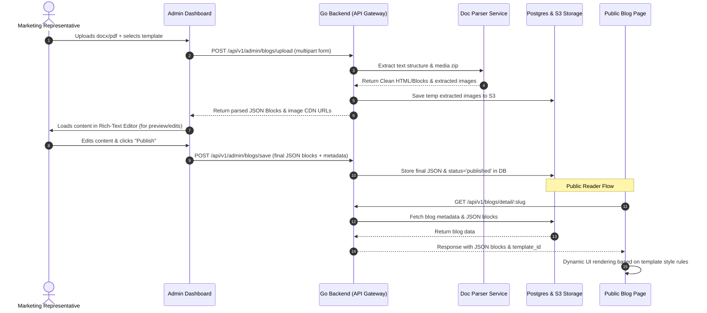

# Lemici Platform: Blog Framework Solution Design
## Functional & Technical Architecture Overview

This document defines the solution design and architectural plan for the **Lemici Blog Framework**. 

The goal of this framework is to empower the Marketing team to self-publish blogs by uploading standard documents (`.docx` / `.pdf`), extracting their text/images, and rendering them dynamically on the frontend using pre-defined templates controlled by the backend.

---

## 1. System Architecture Flow

The workflow handles document upload, content extraction, manual review, block storage, and dynamic template rendering.



---

## 2. Onboarding Workflow (Step-by-Step)

### Step 1: Upload (Admin Panel)
*   The Marketing team logs into the admin panel and navigates to the Blog Creator.
*   They select the target layout template (e.g., *Editorial*, *Visual Case Study*, *Technical Guide*).
*   They upload the `.docx` or `.pdf` file.
*   **Media Handling:** If there are any standalone high-quality images to insert, they can upload them alongside the doc file as attachments.

### Step 2: Content Retrieval & Parsing
*   **For `.docx` Files:** The backend unzips the document to read `word/document.xml`. It extracts paragraphs, headings (`h1`, `h2`, `h3`), bullet lists, and **embedded media** (stored in `word/media/`).
*   **For `.pdf` Files:** The parser extracts textual sections. (PDFs are coordinate-based, so formatting is less structured than docx. We recommend using docx for clean formatting).
*   The parser returns a clean JSON block list representing the document contents.

### Step 3: Marketing Review & Metadata Input (Editor Screen)
*   The extracted content is loaded into an interactive editor (e.g., **Editor.js** or **Lexical**).
*   The Marketing user reviews the layout, inserts/aligns images, writes SEO title/description, defines a slug (e.g., `future-of-camunda-workers`), and enters tags.
*   They hit "Publish" to save it permanently.

---

## 3. Storage Design (Block-Based JSON)

Instead of saving raw HTML in the database (which makes it impossible to change styling in the future without updating every record), we store the content as **Structured Blocks** inside a `jsonb` column in PostgreSQL.

### Database Schema
```sql
CREATE TABLE blogs (
    id UUID PRIMARY KEY DEFAULT gen_random_uuid(),
    title VARCHAR(255) NOT NULL,
    slug VARCHAR(255) UNIQUE NOT NULL,
    author VARCHAR(100) NOT NULL,
    cover_image VARCHAR(512),
    template_id VARCHAR(50) NOT NULL DEFAULT 'standard', -- standard, visual, technical
    status VARCHAR(20) NOT NULL DEFAULT 'draft', -- draft, published, archived
    seo_title VARCHAR(255),
    seo_description TEXT,
    content JSONB NOT NULL, -- Holds the structured block list
    created_at TIMESTAMP WITH TIME ZONE DEFAULT CURRENT_TIMESTAMP,
    updated_at TIMESTAMP WITH TIME ZONE DEFAULT CURRENT_TIMESTAMP
);
```

### JSON Block representation (`content` column)
```json
[
  {
    "type": "header",
    "data": { "text": "Understanding Workflow Engines", "level": 1 }
  },
  {
    "type": "paragraph",
    "data": { "text": "Workflow engines orchestrate business processes automatically..." }
  },
  {
    "type": "image",
    "data": {
      "url": "https://cdn.lemici.com/uploads/blog/workflow-diag.png",
      "caption": "Figure 1: BPMN Execution Flow",
      "alignment": "center"
    }
  }
]
```

---

## 4. Dynamic Frontend Rendering (Template Engine)

The frontend receives the JSON blocks and the `template_id` from the API. The React app runs a dynamic renderer mapping each block type to a designed CSS class:

### Pre-defined Templates:
1.  **Standard Editorial (`template_id = 'standard'`):**
    *   Centered text, elegant Serif typography (e.g., Merriweather/Playfair Display).
    *   Optimized for readability (narrow text column, 650px wide).
2.  **Visual Case Study (`template_id = 'visual'`):**
    *   Full-screen cover photo header, bold sans-serif fonts (e.g., Outfit/Inter).
    *   Alternating side-by-side text/image grids.
3.  **Technical Tutorial (`template_id = 'technical'`):**
    *   Left sidebar table-of-contents auto-generated from header blocks.
    *   Monospace font code-snippets with syntax highlighting.
    *   Support for highlighted tip/warning boxes.

---

## 5. API Design Contract

### A. Admin APIs (Internal Gateway)
*   **Upload Document for Parsing:**
    *   `POST /api/v1/admin/blogs/upload`
    *   *Payload:* Multipart Form (Key: `file` -> `.docx`/`.pdf`, Key: `images[]` -> standalone images)
    *   *Response:* Parsed blocks array and image CDN URLs.
*   **Save/Publish Blog:**
    *   `POST /api/v1/admin/blogs/save`
    *   *Payload:* `{ title, slug, author, cover_image, template_id, status, content: [...] }`
    *   *Response:* `{ success: true, blog_id: "uuid" }`

### B. Public Blog APIs (Public Gateway)
*   **List Blogs (with filters):**
    *   `GET /api/v1/blogs`
    *   *Query params:* `page`, `page_size`, `tag`, `template_id`
*   **Fetch Single Blog (By Slug):**
    *   `GET /api/v1/blogs/detail/:slug`
    *   *Response:* Returns metadata + full JSON blocks structure.
