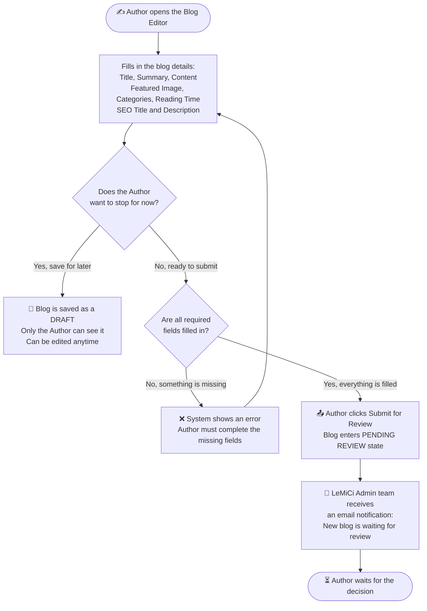
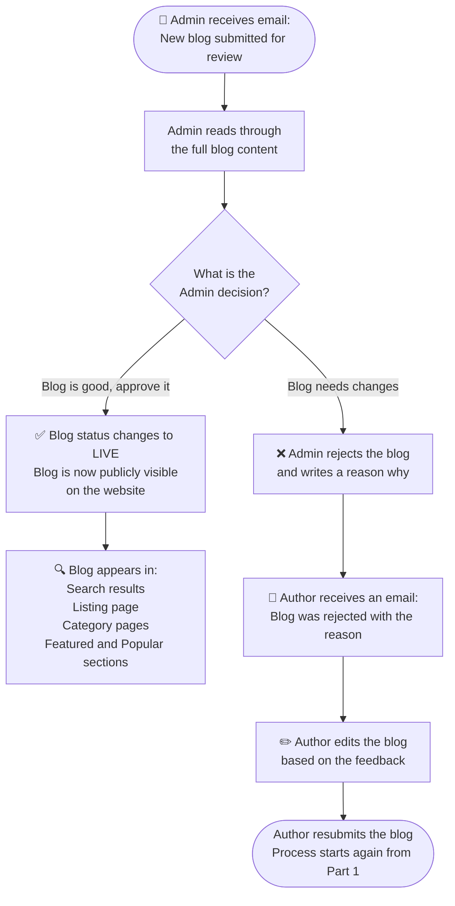
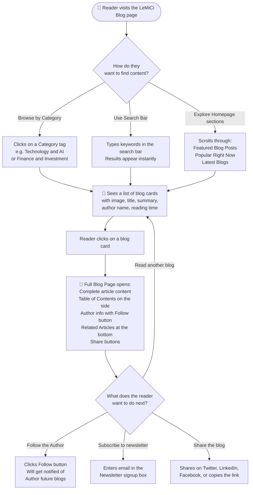
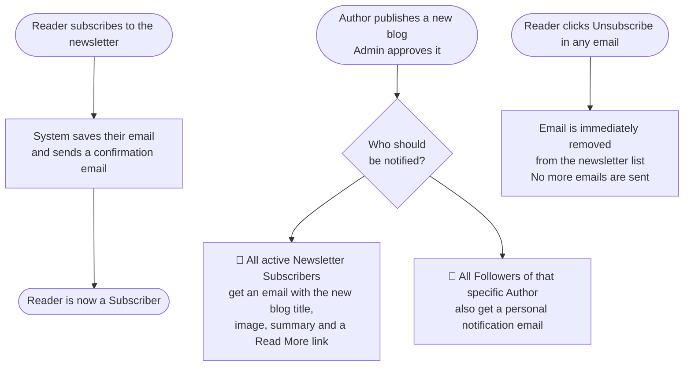
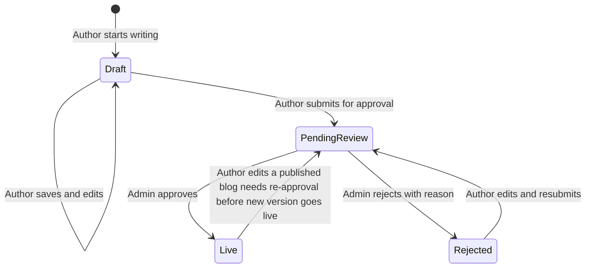
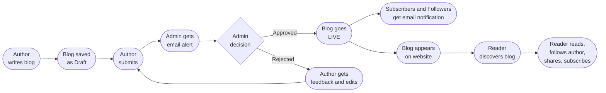

# LeMiCi Blog Platform — How It Works
**For:** Product & Business Team
**Version:** 1.0
**Status:** Draft

---

> This document explains the complete Blog platform flow in plain English — from the moment a writer clicks "Create Blog" to when a reader finds and reads it on the website.

---

## 👥 Who Are the People Involved?

| Person | Who They Are | What They Can Do |
|---|---|---|
| **Guest** | Anyone visiting the website | Browse and read published blogs |
| **Author** | A registered user who creates content | Write, save, and submit blogs |
| **Admin** | LeMiCi internal team member | Review and approve submitted blogs |
| **Subscriber** | Anyone who signed up for the newsletter | Receives email updates about new blogs |
| **Follower** | A registered user who follows an Author | Gets notified when that Author publishes |

---

## 📋 Part 1 — The Author's Journey (Creating a Blog)

This section explains what happens from the moment an Author decides to write a blog.

> **Key Points:**
> - A blog starts as a **Draft** — private, only visible to the Author.
> - Once submitted, the blog becomes **read-only**. The Author cannot edit it while it is being reviewed.
> - The Author gets a confirmation: *"Your blog has been submitted for review."*

---

## 📋 Part 2 — The Admin's Journey (Reviewing a Blog)

Once the Author submits, the ball is in the Admin's court.

> **Key Points:**
> - The Admin reviews the blog **manually** at this stage — no automated system yet.
> - **Rejection always requires a reason** — the Author must know what to fix.
> - Once approved, the blog goes **live immediately** on the public website.

---

## 📋 Part 3 — The Reader's Journey (Discovering and Reading a Blog)

This section explains what a visitor or reader sees when they visit the Blog section of LeMiCi.

> **Key Points from the UI:**
> - Every blog card shows: **Featured Image, Category tag, Title, Summary, Author Name, Date, Reading Time**
> - The Single Blog Page shows: **View Count** (e.g., 208 views), **Table of Contents**, **About the Author card**, **Related Articles**, **Share buttons**, and **Tags** (which are the same as Categories)
> - The **Newsletter signup box** appears on **both** the Home Page and at the bottom of every Blog page.

---

## 📋 Part 4 — Newsletter and Notifications Flow

This explains how readers stay connected with the platform after they leave.

---

## 🗂️ Part 5 — Blog Lifecycle (All Possible States)

A blog goes through different states during its life on the platform.

> **State Visibility Rules:**
> - **Draft** — Private. Only the Author can see it.
> - **Pending Review** — Private. Only the Author and Admin can see it.
> - **Live** — Public. Everyone can see and read it.
> - **Rejected** — Private. Only the Author and Admin can see it, along with the rejection reason.

---

## 📊 Part 6 — What the Reader Sees on Each Page

### Blog Home Page
| Section | What It Shows |
|---|---|
| **Search Bar** | Find blogs by typing any keyword |
| **Explore by Categories** | Filter buttons: All Blogs, Business & Marketing, Technology & AI, etc. |
| **Featured Blog Posts** | Manually selected by the Admin team — shown as a carousel |
| **Popular Right Now** | Blogs with the most views in the last 7 days |
| **Subscribe to Newsletter** | Email signup box |
| **Create Blog CTA** | "Share Your Expertise" section inviting authors to contribute |

### Category / Listing Page
| Section | What It Shows |
|---|---|
| **Search + Category Filter** | Refine results by keyword or category |
| **Blog Cards Grid** | Image, Category Tag, Title, Summary, Author, Date, Reading Time |
| **Pagination** | Page 1, 2, 3 — navigate through results |
| **Popular Right Now** | Section at the bottom |

### Single Blog Page
| Section | What It Shows |
|---|---|
| **Hero** | Category tag, Title, Summary, Author photo + name, Date, Reading time, View count |
| **Content Area** | Full article with Headings, Paragraphs, Bullet Points, Images |
| **Table of Contents** | Auto-generated from the article headings (right sidebar) |
| **About the Author** | Author photo, short bio, Follow button |
| **Tags** | Category tags shown as colored pills at the bottom of article |
| **Related Articles** | 3 to 4 blogs from the same category |
| **Share Buttons** | Twitter, Facebook, LinkedIn, Copy Link |
| **Subscribe Newsletter** | Email signup box at the bottom |

---

## ✅ Summary — The Complete End-to-End Journey

