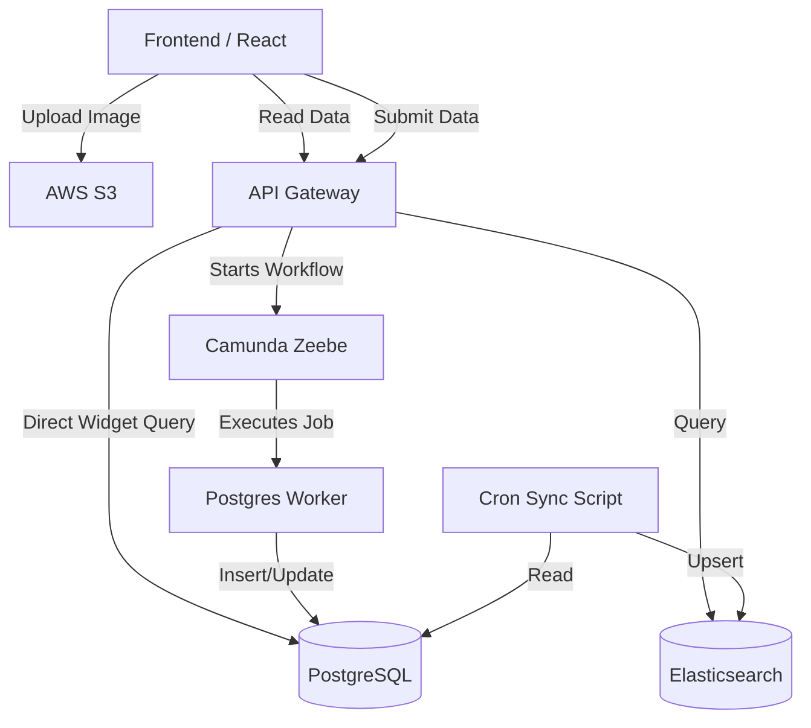

# LeMiCi Blog Platform - End-to-End System Guide

## 1. System Architecture & Overview
The LeMiCi Blog platform is built on a highly scalable, event-driven architecture. 
Instead of traditional monolithic API requests directly modifying the database, the system uses **Camunda Zeebe** to orchestrate workflows, **PostgreSQL** as the source of truth, **Elasticsearch** for blazing-fast read queries, and **AWS S3** for media storage.

---

## 2. Database Schema (Where is data stored?)
The platform uses a relational structure in Postgres to maintain data integrity across blogs, authors, and generic listings.

### `author_profiles` Table
Stores the personalization data for content creators.
- **`user_id`** (PK): References the main `users` table.
- **`full_name`, `author_name`**: Display names.
- **`bio`**: Short introduction about the author.
- **`profile_picture_url`**: Direct S3 link to the author's avatar.
- **`categories`**: Array of topics the author writes about.

### `listings` Table (Core Entity)
Every blog is technically a unified "listing" (where `entity_type = 'blog'`). This allows blogs to share the same rating, reporting, and statistical infrastructure as franchises.
- **`id`**: Unique UUID.
- **`name`**: The Blog Title.
- **`slug`**: URL-friendly string (e.g., `how-to-start-ai-startup`).
- **`description`**: The actual Rich Text HTML content of the blog.
- **`status`**: State of the blog (`LIVE`, `DRAFT`, `PENDING`).

### `blogs` Table (Extension Entity)
Holds blog-specific metadata that doesn't belong in the generic listings table.
- **`id`**: Foreign key to `listings.id`.
- **`reading_time_mins`**: Calculated reading time.
- **`seo_title`, `seo_description`**: Meta tags for search engines.
- **`featured_image_url`**: Primary image shown on cards.
- **`tags`**: Array of keywords.

### `listing_stats` & `listing_categories`
- Tracks the `view_count` for Popularity sorting.
- Maps the blog to overarching system categories (e.g., Tech, Business).

---

## 3. Step-by-Step Flow: Creating a Blog (Example)

**Scenario**: User "Jane Doe" clicks "Create Blog", sets up her profile, writes an article about "AI in 2025", and publishes it.

### Step 3.1: Author Profile Setup (B4 Blog Creation)
1. Jane sees the "Let's personalize your profile" modal.
2. She fills in her Name, Bio, and uploads a Profile Picture.
3. **S3 Upload**: The frontend calls `GET /api/v1/blog/media/presigned`. API Gateway asks AWS for a temporary secure upload URL. 
4. The frontend directly pushes the image bytes to AWS S3, receiving a permanent URL back (e.g., `https://s3.../jane.jpg`).
5. *Note: The profile is held in the frontend's local state and not saved to the DB just yet.*

### Step 3.2: Writing the Content
1. Jane is redirected to the Rich Text Blog Editor.
2. She writes her content, sets SEO tags, and uploads a Featured Image (using the same S3 presigned URL process).
3. She clicks **Publish**.

### Step 3.3: API Gateway & Workflow Submission
1. The frontend calls `POST /api/v1/blog` with a large JSON payload containing BOTH her author profile details and the blog details.
2. `blog_handler.go` intercepts this, attaches `"operation_type": "CREATE_BLOG"`, and triggers the **`blog-submission-workflow`** BPMN process in Zeebe.

### Step 3.4: The Postgres Worker (`blog-postgres`)
1. Camunda Zeebe assigns the job to the backend `blog-postgres` worker.
2. **Upsert Profile**: The worker extracts the author details from the JSON payload. It executes an `INSERT INTO author_profiles ... ON CONFLICT DO UPDATE` query to save Jane's bio and profile pic.
3. **Insert Blog**: The worker then inserts the core content into `listings`, metadata into `blogs`, and initializes `listing_stats`.
4. The worker reports "Success" to Zeebe, and API Gateway returns a `200 OK` to the frontend.

### Step 3.5: Elasticsearch Sync (For Fast Searching)
1. A background cron job (`sync-postgres-to-es.go`) executes.
2. It queries Postgres for all live blogs, joining `listings`, `blogs`, and `author_profiles` together.
3. It pushes a flattened document into the `blog_listings` index in Elasticsearch.
4. Now, when a user visits the Homepage, Elasticsearch instantly returns the blog complete with Jane's author photo and bio!

---

## 4. API Endpoint Reference

| Endpoint | Method | Primary Purpose | Sub-system Flow |
|----------|--------|-----------------|-----------------|
| `/api/v1/blog` | `POST` | Create a new blog + Upsert Author Profile | API Gateway → Zeebe → Postgres |
| `/api/v1/blog/:id` | `PUT` | Update an existing blog | API Gateway → Zeebe → Postgres |
| `/api/v1/blog/media/presigned` | `GET` | Get temporary AWS S3 upload URL | API Gateway → AWS S3 |
| `/api/v1/blog/home` | `GET` | Fetch Featured & Popular sections in parallel | API Gateway → Zeebe → Elasticsearch |
| `/api/v1/blog/listing` | `GET` | Search, filter, and paginate blogs | API Gateway → Zeebe → Elasticsearch |
| `/api/v1/blog/featured` | `GET` | Lightweight widget for featured blogs | API Gateway → Direct Postgres |
| `/api/v1/blog/popular` | `GET` | Lightweight widget for popular blogs | API Gateway → Direct Postgres |
| `/api/v1/blog/subscribe` | `POST` | Subscribe user to the newsletter | API Gateway → Zeebe → Postgres |
| `/api/v1/authors/:id/follow` | `POST` | Follow a specific author | API Gateway → Zeebe → Postgres |

---

## 5. Why this architecture?
1. **Performance**: By segregating reads (Elasticsearch) from writes (Postgres), the platform can handle thousands of concurrent readers without slowing down the database.
2. **Resilience**: If the Postgres database temporarily slows down, Zeebe will queue the blog creation jobs and retry them automatically, ensuring no data is ever lost.
3. **Cost Efficiency**: Uploading media directly to S3 from the frontend means the Go servers don't waste CPU/RAM processing heavy image bytes.
