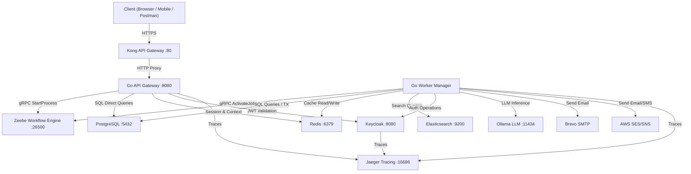
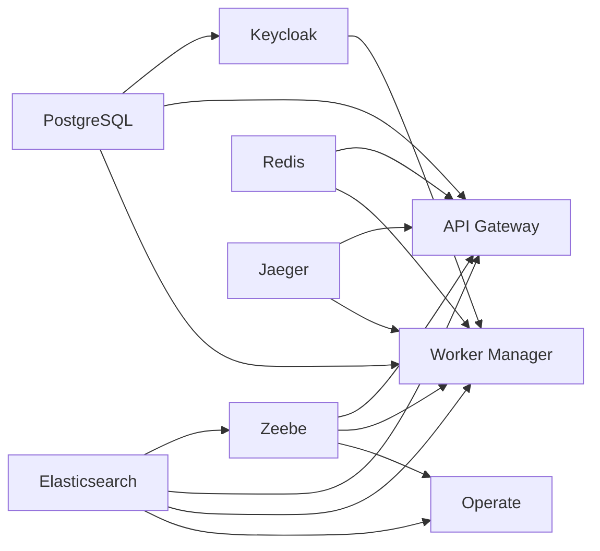
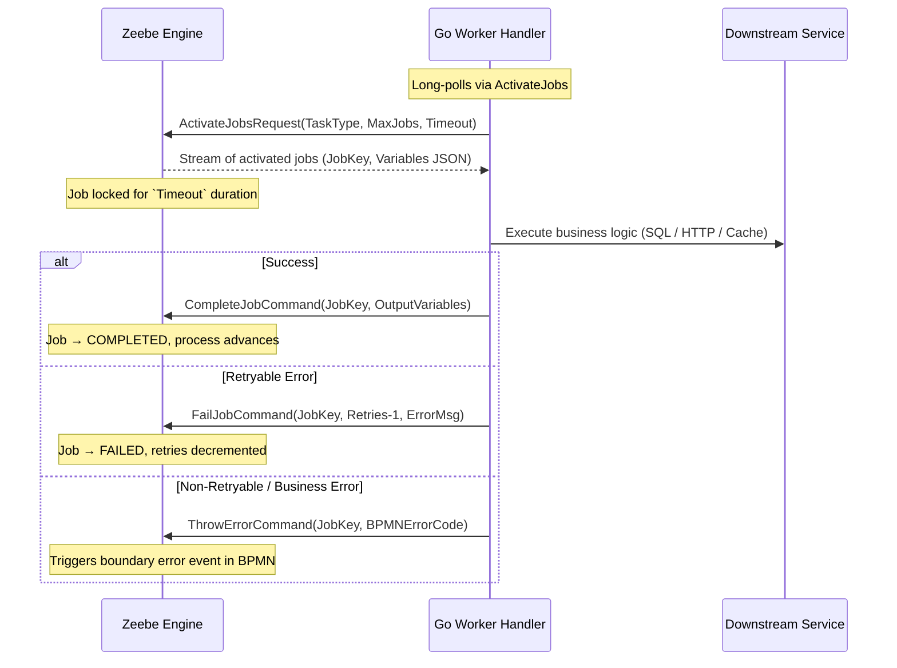
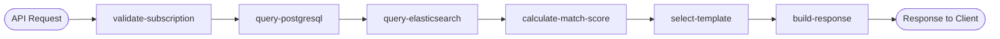
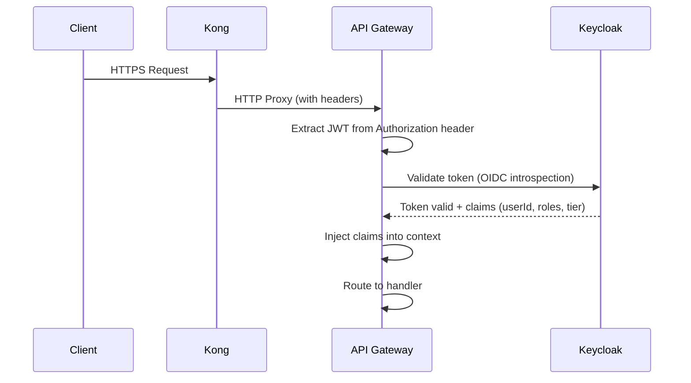

# LeMiCi Platform — Backend Architecture, Workflow Engine & Workers
## Comprehensive Guide for Load Testing & Stress Testing

**Prepared for**: Thejaswini, Operations Platform Development Team  
**Author**: Engineering Team  
**Date**: June 2026 | **System Version**: V2  
**Classification**: Internal — Engineering Reference

---

## Table of Contents

1. [Executive Summary](#1-executive-summary)
2. [System Architecture Overview](#2-system-architecture-overview)
3. [Docker Infrastructure & Service Topology](#3-docker-infrastructure--service-topology)
4. [Camunda/Zeebe Workflow Engine Deep Dive](#4-camundazeebe-workflow-engine-deep-dive)
5. [BPMN Workflows — All 10 Deployed Processes](#5-bpmn-workflows--all-10-deployed-processes)
6. [API Gateway — Complete Endpoint Reference](#6-api-gateway--complete-endpoint-reference)
7. [Worker Architecture & All 27 Worker Profiles](#7-worker-architecture--all-27-worker-profiles)
8. [Database Schema — PostgreSQL Tables & Indexes](#8-database-schema--postgresql-tables--indexes)
9. [Caching Strategy — Redis Patterns](#9-caching-strategy--redis-patterns)
10. [Elasticsearch — Search Engine Configuration](#10-elasticsearch--search-engine-configuration)
11. [Security Architecture](#11-security-architecture)
12. [Observability Stack — Monitoring, Tracing, Logging](#12-observability-stack--monitoring-tracing-logging)
13. [Flagsmith Feature Flags Integration](#13-flagsmith-feature-flags-integration)
14. [Configuration Management](#14-configuration-management)
15. [Error Handling Architecture](#15-error-handling-architecture)
16. [Connection Pools & Resource Bottlenecks](#16-connection-pools--resource-bottlenecks)
17. [Load Testing Methodology & Tools](#17-load-testing-methodology--tools)
18. [Stress Testing Scenarios](#18-stress-testing-scenarios)
19. [Metrics to Monitor During Tests](#19-metrics-to-monitor-during-tests)
20. [Tuning Recommendations](#20-tuning-recommendations)
21. [Environment Variables Reference](#21-environment-variables-reference)
22. [Glossary](#22-glossary)

---

## 1. Executive Summary

The LeMiCi platform is a **franchise marketplace** built on an event-driven, microservices architecture. Two custom Go binaries — the **API Gateway** and the **Worker Manager** — orchestrate business logic through the **Camunda 8 (Zeebe)** workflow engine. All user interactions (search, application, authentication, AI Q&A) are modeled as BPMN workflows, with each task executed by a dedicated, stateless Go worker.

**Key Numbers for Load Testing:**
- **2 Go microservices**: API Gateway + Worker Manager
- **10 BPMN workflow definitions** deployed to Zeebe
- **32 registered Go workers** processing Zeebe jobs (excluding deprecated CRM workers)
- **20+ PostgreSQL tables** with indexes and constraints
- **5 Elasticsearch indices** for application data (listings, home, industries, insights, browse)
- **Redis** for caching, sessions, and idempotency
- **Kong API Gateway** as the edge reverse proxy

---

## 2. System Architecture Overview

### 2.1 High-Level Data Flow



### 2.2 Core Components

| Component | Technology | Role |
| :--- | :--- | :--- |
| **Edge Gateway** | Kong 3.6 | TLS termination, rate limiting, CORS, request routing |
| **API Gateway** | Go (Gin framework) | REST API, JWT auth, workflow triggering, direct DB handlers |
| **Workflow Engine** | Camunda Zeebe 8.3.9 | BPMN orchestration, job distribution, state management |
| **Worker Manager** | Go (Zeebe SDK) | 27 stateless workers executing business logic |
| **Primary Database** | PostgreSQL 15 | Relational data store for all entities |
| **Search Engine** | Elasticsearch 8.9.0 | Full-text search, fuzzy matching, aggregations |
| **Cache / Sessions** | Redis 7 | Cache-aside, session store, idempotency keys |
| **Identity Provider** | Keycloak 23.0 | OIDC, OAuth2, user management, RBAC |
| **LLM Engine** | Ollama (Qwen model) | AI intent parsing, franchise search extraction |
| **Email Service** | Brevo SMTP / AWS SES | Transactional & campaign emails |
| **Tracing** | Jaeger 1.52 | Distributed tracing via OpenTelemetry |
| **Workflow UI** | Camunda Operate 8.3.9 | Visual workflow monitoring dashboard |

---

## 3. Docker Infrastructure & Service Topology

All services run inside a single Docker Compose stack on a bridged network (`camunda-network`). Below is the complete inventory from `deployments/docker/docker-compose.yml`.

### 3.1 Service Inventory

| Service | Image | Port(s) | Resource Config | Health Check |
| :--- | :--- | :--- | :--- | :--- |
| **zeebe** | `camunda/zeebe:8.3.9` | `26500` (gRPC), `9600` (metrics) | `-Xms1g -Xmx1g`, 4 CPU threads, 4 IO threads | TCP on `9600`, 30s interval |
| **postgres** | `postgres:15-alpine` | `5432` | `max_connections=200` | `pg_isready`, 5s interval |
| **redis** | `redis:7-alpine` | `6379` | Default | `redis-cli ping`, 5s interval |
| **elasticsearch** | `elasticsearch:8.9.0` | `9200` | `-Xms1g -Xmx1g`, single-node | Cluster health API, 10s interval |
| **keycloak** | `keycloak:23.0` | Internal `8080` | Postgres-backed, OpenTelemetry agent | HTTP health, 30s interval |
| **ollama** | `ollama/ollama:latest` | `11434` | `OLLAMA_NUM_PARALLEL=1`, 30m keep-alive | — |
| **operate** | `camunda/operate:8.3.9` | `8082` → `8080` | Reads from ES + Zeebe | — |
| **jaeger** | `jaegertracing/all-in-one:1.52` | `16686` (UI), `4317` (OTLP gRPC), `4318` (OTLP HTTP) | In-memory span storage | HTTP on `16686` |
| **api-gateway** | Custom ECR image | Internal `8080` | Depends on PG, Redis, ES, Zeebe, Jaeger | `/health`, 30s interval |
| **camunda-workers** | Custom ECR image | — | Depends on all infra + Keycloak | Process check, 30s interval |
| **kong** | `kong:3.6` | `80` → `8000` | DB-less (declarative YAML), bundled plugins | `kong health`, 30s interval |
| **mailhog** | `mailhog/mailhog:latest` | `1025` (SMTP), `8025` (UI) | Development email trap | — |

### 3.2 Docker Volumes (Persistent Data)

| Volume | Mounted In | Purpose |
| :--- | :--- | :--- |
| `zeebe-data` | Zeebe | Workflow state, snapshots, logs |
| `postgres-data` | PostgreSQL | All relational data |
| `es-data` | Elasticsearch | Search indices |
| `redis-data` | Redis | Cache persistence (RDB) |
| `keycloak-data` | Keycloak | Realm data, themes |
| `ollama-data` | Ollama | Model weights (Qwen GGUF) |

### 3.3 Startup Dependency Chain



**Load Testing Implication**: During startup, Zeebe waits for Elasticsearch to be healthy (up to 120s start period). If ES is slow under load, Zeebe will fail to start. Monitor ES heap usage carefully.

---

## 4. Camunda/Zeebe Workflow Engine Deep Dive

### 4.1 Zeebe Broker Configuration

| Setting | Value | Impact on Load Testing |
| :--- | :--- | :--- |
| Partition Count | `1` | All jobs go through a single partition — this is the primary scaling bottleneck |
| Replication Factor | `1` | No failover; single broker |
| CPU Threads | `4` | Handles command processing |
| IO Threads | `4` | Handles gRPC communication |
| JVM Heap | `1 GB` | May OOM under very high workflow instance counts |
| Snapshot Period | `5 min` | Creates state snapshots every 5 minutes |
| Log Segment Size | `128 MB` | Compacts old segments |
| Disk Reclaim | `true` | Frees disk after snapshot |
| ES Exporter Bulk Size | `1` | Exports events to ES immediately (low latency, high ES write load) |

### 4.2 Job Lifecycle (gRPC Protocol)



**Key Concepts for Load Testing:**
1. **MaxJobsActive**: Client-side concurrency cap. If set to `5`, only 5 jobs run simultaneously per worker type.
2. **Job Lock Timeout**: Zeebe locks a job for `Timeout` ms. If the worker doesn't respond before the lock expires (e.g., slow DB), Zeebe reassigns the job → potential **duplicate execution**.
3. **Single Partition Bottleneck**: With 1 partition, all jobs are serialized through one processing pipeline. Under extreme load, this becomes the ceiling.

### 4.3 Worker Registration Pattern

```go
func startWorker(client zbc.Client, taskType string, wcfg config.WorkerConfig,
    handlerFunc func(worker.JobClient, entities.Job), log *zap.Logger) {
    client.NewJobWorker().
        JobType(taskType).
        Handler(handlerFunc).
        MaxJobsActive(wcfg.MaxJobsActive).
        Timeout(time.Duration(wcfg.Timeout) * time.Millisecond).
        Open()
}
```

---

## 5. BPMN Workflows — All 10 Deployed Processes

The following BPMN files are deployed to Zeebe from the `bpmn/` directory:

| # | BPMN File | Process ID | Workers Involved | Primary Use Case |
| :--- | :--- | :--- | :--- | :--- |
| 1 | `franchise-detail-page.bpmn` | `franchise_detail` | validate-subscription, query-postgresql, query-elasticsearch, calculate-match-score, select-template, build-response | View franchise details with match scoring |
| 2 | `franchise-listing-page.bpmn` | `franchise_listing` | validate-subscription, search-franchises, query-postgresql, apply-relevance-ranking, select-template, build-response | Browse/search franchise listings |
| 3 | `franchise-home-page.bpmn` | `franchise_home` | query-elasticsearch, query-postgresql, build-response | Home page data aggregation |
| 4 | `franchise-industry-browse.bpmn` | `franchise_industry` | query-postgresql, query-elasticsearch, build-response | Browse franchises by industry |
| 5 | `franchise-enquiry-submission.bpmn` | `franchise_enquiry` | validate-enquiry-data, create-application-record, email-send, send-notification | Submit franchise enquiry |
| 6 | `franchise-user-actions.bpmn` | `franchise_user_actions` | franchise-postgres, send-api-response | User actions (favorite, rate, share, bookmark) |
| 7 | `keycloak-login-workflow.bpmn` | `keycloak_login` | keycloak-signin, session-manager, captcha-verify | Keycloak-based SSO login |
| 8 | `keycloak-logout-workflow.bpmn` | `keycloak_logout` | auth-logout, session-manager | User logout + session cleanup |
| 9 | `public-form-submission.bpmn` | `public_form_submission` | validate-enquiry-data, franchise-postgres, email-send | Public form submission (contact, enquiry) |
| 10 | `supplier-onboarding.bpmn` | `supplier_onboarding` | franchise-postgres, email-send, send-notification | Unified franchise/association onboarding |

### 5.1 Workflow Execution Example — Franchise Detail Page



**Workers in sequence**: 6 workers execute serially. End-to-end latency = sum of all worker execution times.

**Load Testing Implication**: If each worker takes ~200ms, the workflow takes ~1.2s minimum. Under load, each worker queues in Zeebe if `MaxJobsActive` is reached. A single slow worker (e.g., `calculate-match-score` hitting DB) blocks the entire chain.

---

## 6. API Gateway — Complete Endpoint Reference

### 6.1 Middleware Chain (Order of Execution)

```
Request → gin.Recovery → RequestID → Logger → CORS → SecurityHeaders → [Auth Middleware] → Handler
```

| Middleware | Purpose |
| :--- | :--- |
| `gin.Recovery()` | Catches panics, returns 500 |
| `RequestID()` | Generates UUID for each request |
| `Logger()` | Structured JSON request logging |
| `CORS()` | Cross-origin request handling |
| `SecurityHeaders()` | HSTS, X-Content-Type-Options, etc. |
| `JWT Auth` | Validates JWT token via Keycloak (protected routes only) |
| `Rate Limiter` | 100 req/s per IP, burst 200 (protected routes) |

### 6.2 Complete Endpoint Table

#### Public Routes (`/api/v1/public`) — No Authentication Required

| Method | Endpoint | Type | Description |
| :--- | :--- | :--- | :--- |
| POST | `/auth/google/signup` | Workflow | Google OAuth sign-up |
| POST | `/auth/google/signin` | Workflow | Google OAuth sign-in |
| POST | `/auth/linkedin/signup` | Workflow | LinkedIn OAuth sign-up |
| POST | `/auth/linkedin/signin` | Workflow | LinkedIn OAuth sign-in |
| POST | `/auth/login` | Workflow | Email/password login |
| POST | `/auth/signup` | Workflow | Email/password sign-up |
| POST | `/auth/password/reset` | Workflow | Password reset |
| POST | `/auth/logout` | Workflow | User logout |
| GET | `/franchises/search` | Direct | Search franchises (public) |
| GET | `/franchises/suggest` | Direct | Autocomplete suggestions |
| GET | `/franchises/stats` | Direct | Platform statistics |
| GET | `/franchises/:id` | Direct | Get franchise by ID |
| GET | `/franchises/categories` | Direct | Get all categories |
| GET | `/franchises/featured` | Direct | Featured franchises |

#### Protected Routes (`/api/v1`) — JWT Required

| Method | Endpoint | Type | Description |
| :--- | :--- | :--- | :--- |
| POST | `/ai/query` | Workflow | AI conversation query |
| POST | `/ai/discovery` | Workflow | AI franchise discovery |
| PUT | `/user/profile` | Workflow | Update user profile |
| DELETE | `/user/account` | Workflow | Delete user account |
| POST | `/franchises/search` | Workflow | Personalized search |
| GET | `/franchises/details/:id` | Workflow | Get franchise details (with match score) |
| POST | `/franchises/favorite/:id` | Direct | Add to favorites |
| DELETE | `/franchises/favorite/:id` | Direct | Remove from favorites |
| GET | `/franchises/favorites` | Direct | Get user favorites |
| POST | `/franchises/create` | Workflow | Create franchise |
| PUT | `/franchises/:id` | Workflow | Update franchise (admin) |
| DELETE | `/franchises/:id` | Workflow | Delete franchise (admin) |
| GET | `/franchises/full/:slug` | Workflow | Get full franchise data |
| POST | `/applications/submit` | Workflow | Submit franchise application |
| POST | `/applications/approve` | Workflow | Approve application activity |
| POST | `/email/campaign` | Workflow | Start email campaign |
| POST | `/email/welcome-series` | Workflow | Welcome email series |
| POST | `/error/handle` | Workflow | Error handling workflow |

#### Admin Routes (`/api/admin`) — JWT + Admin Role

| Method | Endpoint | Type | Description |
| :--- | :--- | :--- | :--- |
| GET | `/workflows` | Direct | List active workflows |
| GET | `/workflows/:id/status` | Direct | Get workflow status |
| POST | `/workflows/:id/cancel` | Direct | Cancel running workflow |

### 6.3 Rate Limiting Configuration

```yaml
api:
  rateLimit:
    enabled: true
    requestsPerSecond: 100
    burst: 200
```

**Load Testing Implication**: At 100 req/s per IP, you will start receiving HTTP `429 Too Many Requests` once you exceed 200 requests in a burst. For internal load testing, either:
- Disable rate limiting (`enabled: false`)
- Increase thresholds to match test throughput
- Use multiple source IPs

---

## 7. Worker Architecture & All 32 Active Worker Profiles

### 7.1 Worker Domain Organization

```
internal/workers/
├── infrastructure/          (5 workers)
│   ├── validate-subscription
│   ├── build-response
│   ├── select-template
│   ├── send-api-response
│   └── template-driven
├── data-access/             (4 workers)
│   ├── query-postgresql
│   ├── query-elasticsearch
│   ├── franchise-postgres
│   └── sync-to-elasticsearch-v2
├── ai-conversation/         (5 workers)
│   ├── ai-search
│   ├── parse-user-intent
│   ├── query-internal-data
│   ├── enrich-web-search
│   └── llm-synthesis
├── franchise/               (5 workers)
│   ├── search-franchises
│   ├── parse-search-filters
│   ├── apply-relevance-ranking
│   ├── calculate-match-score
│   └── validate-entity-data
├── application/             (6 workers)
│   ├── validate-application-data
│   ├── validate-enquiry-data
│   ├── check-readiness-score
│   ├── check-priority-routing
│   ├── create-application-record
│   └── send-notification
├── auth/                    (4 workers)
│   ├── keycloak-signin
│   ├── session-manager
│   ├── auth-logout
│   └── captcha-verify
├── communication/           (1 worker)
│   └── email-send
├── operate/                 (3 modules)
│   ├── actions
│   ├── queries
│   └── ws
└── public-forms/            (2 workers)
    ├── validate-public-form
    └── save-public-form
```

### 7.2 Complete Worker Configuration Table

| # | Task Type | Dependencies | MaxJobsActive | Timeout (ms) | Concurrency | Poll Interval |
| :--- | :--- | :--- | :--- | :--- | :--- | :--- |
| 1 | `ai-search` | Ollama LLM | 50 | 40000 | 5 | 25ms |
| 2 | `franchise-postgres` | PostgreSQL | 10 | 30000 | — | 100ms |
| 3 | `validate-subscription` | PostgreSQL, Redis | 5 | 10000 | — | — |
| 4 | `build-response` | Local JSON templates | 50 | 5000 | 5 | 25ms |
| 5 | `select-template` | Local config | 5 | 10000 | — | — |
| 6 | `query-postgresql` | PostgreSQL | 50 | 10000 | 10 | 25ms |
| 7 | `query-elasticsearch` | Elasticsearch | 50 | 10000 | 10 | 25ms |
| 8 | `parse-search-filters` | None (CPU-only) | 5 | 10000 | — | — |
| 9 | `apply-relevance-ranking` | None (CPU-only) | 5 | 10000 | — | — |
| 10 | `calculate-match-score` | PostgreSQL, Redis | 5 | 10000 | — | — |
| 11 | `search-franchises` | Elasticsearch | 10 | 10000 | 5 | — |
| 12 | `validate-application-data` | None (CPU-only) | 5 | 10000 | — | — |
| 13 | `check-readiness-score` | None (CPU-only) | 5 | 10000 | — | — |
| 14 | `check-priority-routing` | PostgreSQL, Redis | 5 | 10000 | — | — |
| 15 | `create-application-record` | PostgreSQL | 5 | 10000 | — | — |
| 16 | `send-notification` | AWS SES/SNS | 5 | 10000 | — | — |
| 17 | `parse-user-intent` | GenAI HTTP API | 5 | 10000 | — | 50ms |
| 18 | `query-internal-data` | PostgreSQL, ES | 5 | 10000 | — | — |
| 19 | `enrich-web-search` | Web Search API | 5 | 10000 | — | — |
| 20 | `llm-synthesis` | GenAI HTTP API | 5 | 5000 | — | — |
| 21 | `auth-logout` | Keycloak, Redis | 5 | 5000 | — | — |
| 22 | `captcha-verify` | Google reCAPTCHA | 5 | 10000 | — | — |
| 23 | `email-send` | Brevo SMTP / AWS SES | 5 | 15000 | — | — |
| 24 | `template-driven` | Local templates | 10 | 30000 | — | — |
| 25 | `send-api-response` | HTTP callback | 50 | 5000 | 10 | 25ms |
| 26 | `keycloak-signin` | Keycloak API | 10 | 30000 | — | — |
| 27 | `session-manager` | Redis | 10 | 10000 | — | — |
| 28 | `validate-enquiry-data` | None (CPU-only) | 5 | 10000 | — | — |
| 29 | `validate-entity-data` | None (CPU-only) | 10 | 10000 | — | — |
| 30 | `sync-to-elasticsearch-v2` | PostgreSQL, ES | 10 | 10000 | — | — |
| 31 | `validate-public-form` | None (CPU-only) | 10 | 10000 | — | — |
| 32 | `save-public-form` | PostgreSQL | 10 | 10000 | — | — |

### 7.3 Worker Handler Structure

Every worker follows this standardized Go pattern:

```go
type Handler struct {
    config   *Config
    db       *sql.DB           // PostgreSQL connection pool (shared)
    redis    *redis.Client     // Redis client (shared)
    esClient *database.ESClient // Elasticsearch client (shared)
    logger   logger.Logger
}

func (h *Handler) Handle(client worker.JobClient, job entities.Job) {
    // 1. Parse JSON variables from Zeebe
    var input Input
    if err := json.Unmarshal([]byte(job.Variables), &input); err != nil {
        h.failJob(client, job, "PARSE_ERROR", err.Error(), 0)
        return
    }

    // 2. Create context with timeout
    ctx, cancel := context.WithTimeout(context.Background(), h.config.Timeout)
    defer cancel()

    // 3. Execute business logic
    output, err := h.execute(ctx, &input)
    if err != nil {
        h.handleFailure(client, job, err) // Classifies error → retry or BPMN error
        return
    }

    // 4. Complete job
    h.completeJob(client, job, output)
}
```

### 7.4 Detailed Worker Profiles

#### Infrastructure Workers

**`validate-subscription`** — Validates user subscription tier before allowing feature access.
- **Flow**: Check Redis cache (`sub:{userId}`, 5min TTL) → If miss, query `user_subscriptions` table → Cache result
- **SQL**: `SELECT user_id, tier, expires_at, is_valid FROM user_subscriptions WHERE user_id = $1`
- **Error Codes**: `SUBSCRIPTION_INVALID` (no retry), `SUBSCRIPTION_EXPIRED` (no retry), `SUBSCRIPTION_CHECK_FAILED` (3 retries)
- **Used in**: All 4 core workflows (AI, Discovery, Detail, Application)

**`build-response`** — Constructs standardized response payloads using configurable templates.
- **Flow**: Load template from `configs/templates.json` (in-memory cache, 1hr TTL) → Validate input against JSON schema → Replace `{{key}}` placeholders → Build response with metadata
- **Error Codes**: `TEMPLATE_NOT_FOUND`, `TEMPLATE_VALIDATION_FAILED`

**`select-template`** — Selects response template based on subscription tier, route, and confidence score.
- **Flow**: Premium users → enhanced templates; Free users → basic templates; Route-specific templates take precedence

**`send-api-response`** — Sends the final response back to the API Gateway or callback URL.
- **High concurrency**: 50 max jobs, 10 concurrent, 5s timeout

**`template-driven`** — Generic template processor for dynamic content generation.

#### Data Access Workers

**`query-postgresql`** — Generic parameterized SQL executor using a registry pattern.
- **Query Types**: `franchise_full_details`, `franchise_outlets`, `franchise_verification`, `franchise_details`, `user_profile`
- **Registry**: `queries.Registry` maps `QueryType` → `QueryFunc`
- **Returns**: `{data, rowCount, queryExecutionTime}`
- **Error Codes**: `QUERY_TIMEOUT` (2 retries), `INVALID_QUERY_TYPE` (no retry), `QUERY_EXECUTION_FAILED` (no retry)

**`query-elasticsearch`** — Generic Elasticsearch query executor.
- **Query Types**: `franchise_index`, `related_franchises`
- **Error Codes**: `ELASTICSEARCH_CONNECTION_FAILED` (retry), `SEARCH_TIMEOUT` (retry), `INDEX_NOT_FOUND` (no retry)

**`franchise-postgres`** — Unified CRUD worker for all franchise-related PostgreSQL operations.
- **22 operations**: CREATE/UPDATE/GET/DELETE for Franchise, Business Overview, Investment, Operations, Social Links, Stats, Category Questions, Franchise Cities
- **Transaction-based**: All writes use `BeginTx` + `Commit`/`Rollback`
- **Validation**: Email format, URL format, UUID, year ranges
- **Error Codes**: `PARSE_ERROR`, `INVALID_OPERATION`, `VALIDATION_ERROR`, `NOT_FOUND`, `DATABASE_ERROR` (2 retries)
- **Supported Tables**: `franchises`, `franchise_business_overview`, `franchise_investment_requirement`, `franchise_operations`, `franchise_social_links`, `franchise_stats`, `category_questions`, `franchise_cities`

**`sync-to-elasticsearch-v2`** — Syncs PostgreSQL franchise data to Elasticsearch index.

#### AI/ML Workers

**`ai-search`** — Local LLM-based franchise search extraction using Ollama.
- **LLM Config**: Provider: `ollama`, Model: `franchise-extractor`, Endpoint: `http://ollama:11434`, Timeout: 35s, Max tokens: 300, Temperature: 0.0
- **Warning**: `OLLAMA_NUM_PARALLEL=1` — only 1 concurrent inference. Under load, all other AI jobs queue.

**`parse-user-intent`** — Calls GenAI API to extract intent, entities, and data sources from user queries.
- **API**: `POST {GenAIBaseURL}/api/ai/parse-intent`
- **Retry**: Exponential backoff (100ms, 200ms, 400ms)
- **Fallback**: If API doesn't return data sources, worker determines them from intent/entities

**`query-internal-data`** — Retrieves internal franchise data from PostgreSQL + Elasticsearch based on extracted entities.

**`enrich-web-search`** — Enriches responses with external web data via Google Custom Search API.
- **Timeout**: 3s (fail-fast)
- **No retries** — web search is best-effort

**`llm-synthesis`** — Synthesizes final AI response by combining internal data, web data, and user intent.
- **Timeout**: 5s (very aggressive)

#### Franchise Workers

**`search-franchises`** — Elasticsearch-based franchise search with multi-match, filters, and suggestions.
- **Field boosting**: `brand^3`, `description^2`
- **Fuzziness**: Configurable (default `AUTO`)
- **Supports**: Category, location, investment range, space, rating, tags filters

**`calculate-match-score`** — Calculates seeker-franchise compatibility (0-100).
- **Weights**: Financial 30%, Experience 25%, Location 20%, Interest 25%
- **Redis cache**: `match:{userId}:{franchiseId}`, 10min TTL

**`parse-search-filters`** — Parses raw filter objects into structured format.

**`apply-relevance-ranking`** — Sorts search results by combined relevance score.

#### Application Workers

**`validate-application-data`** — Validates personal info (name, email, phone), financial info (capital, credit score), experience.

**`check-readiness-score`** — Calculates readiness score (0-100) across 4 dimensions: Financial 30%, Experience 25%, Location 20%, Interest 25%.

**`check-priority-routing`** — Determines routing priority based on franchise premium status.
- **Redis cache**: 30min TTL for routing decisions

**`create-application-record`** — Inserts into `franchise_applications` table with idempotency check.
- **Duplicate detection**: Partial unique index on `(seeker_id, franchise_id)` where status IN ('submitted', 'under_review')

**`send-notification`** — Multi-channel notification (email via AWS SES, SMS via AWS SNS, push).

**`validate-enquiry-data`** — Validates enquiry/contact form submissions.

#### Authentication Workers

**`keycloak-signin`** — OIDC authorization code flow via Keycloak.
- **OAuth providers**: Google, LinkedIn
- **State TTL**: 5 minutes
- **Timeout**: 30s (includes external API roundtrips)

**`session-manager`** — Creates/updates Redis sessions.
- **Session TTL**: 24 hours
- **Cookie**: `AUTH_SESSION_ID`, Secure, HttpOnly, SameSite=None

**`auth-logout`** — Revokes Keycloak refresh token + deletes Redis session.

**`captcha-verify`** — Google reCAPTCHA verification with score validation.

#### Communication Workers

**`email-send`** — Sends email via Brevo SMTP (primary) or AWS SES (fallback).
- **Supports**: HTML/plain text, attachments, CC/BCC
- **Timeout**: 15s
- **Retries**: 3

#### Public Forms & Utilities Workers

**`validate-entity-data`** — Validates basic entity-level fields for new franchises or associations.
- **Flow**: Reads `entityType` and `formData` → Checks required fields (`brandName`/`companyName` for franchises; `associationName` for associations) → Completes job returning `isValid` and error details.
- **Used in**: Onboarding and validation workflows.

**`sync-to-elasticsearch-v2`** — Synchronizes entity data between PostgreSQL and Elasticsearch.
- **Flow**: Retrieves full details from PostgreSQL by `franchiseId` → Checks status → Indexes live franchises to `franchise_listings` index, or deletes them if draft/archived.
- **SQL**: `SELECT id, name, slug, short_description, description, contact_email, entity_type, status, trusted_seller, verified, total_outlets, outlet_range, industry, business_type, established_year, units_count, logo_url, association_metadata FROM franchises WHERE id = $1`
- **Used in**: Onboarding sync pipeline.

**`validate-public-form`** — Performs input format and field validations for public contact or network signup forms.
- **Flow**: Parsed inputs validated using `ozzo-validation` patterns (email check, phone formatting) and specific rules based on `formType` (`contact_us`, `join_network`, `list_franchise`).
- **Used in**: Contact Us and Lead capture workflows.

**`save-public-form`** — Persists public contact/lead form entries to PostgreSQL.
- **Flow**: Serializes form payload to JSON and inserts it into `public_form_submissions` table.
- **SQL**: `INSERT INTO public_form_submissions (form_type, email, phone, form_data) VALUES ($1, $2, $3, $4) RETURNING id`
- **Used in**: Public form submission workflows.

---

## 8. Database Schema — PostgreSQL Tables & Indexes

The database `franchises` contains 20+ tables initialized from `deployments/docker/postgres/30-schema.sql`.

### 8.1 Table Inventory

| Table | Rows Under Load | Primary Key | Key Indexes | Load Profile |
| :--- | :--- | :--- | :--- | :--- |
| `users` | Moderate | UUID | `idx_users_email` | Auth reads/writes |
| `identities` | Low | UUID | `identities_user_id_idx` | OAuth lookups |
| `user_subscriptions` | Hot read | UUID | `(user_id, tier)` unique | Validated on every workflow |
| `idempotency_keys` | High write | UUID | `idx_idempotency_key`, `idx_idempotency_expires` | Write-heavy, TTL cleanup |
| `industries` | Static/cached | UUID | `idx_industries_slug` | Rarely written |
| `categories` | Static/cached | UUID | `idx_categories_slug`, `idx_categories_industry` | Rarely written |
| `sub_categories` | Static/cached | UUID | `idx_sub_categories_slug` | Rarely written |
| `franchises` | Core entity | UUID | `idx_franchises_slug`, `idx_franchises_entity_type_status` | Heavy reads, moderate writes |
| `franchise_categories` | Junction | UUID | `idx_franchise_categories_franchise` | Read with joins |
| `franchise_stats` | **Hot read/write** | UUID | `idx_franchise_stats_franchise` (unique) | Updated on every view/like/share |
| `franchise_cities` | Read-heavy | UUID | `idx_franchise_cities_franchise`, `idx_franchise_cities_city` | Location-based queries |
| `franchise_business_overview` | Read-heavy | UUID | `idx_business_overview_franchise_id` (unique) | Detail page |
| `franchise_investment_requirement` | Read-heavy | UUID | `idx_investment_franchise_id` (unique) | Detail + search filters |
| `franchise_operations` | Read-heavy | UUID | `idx_operations_franchise_id` (unique) | Detail page |
| `franchise_social_links` | Read-heavy | UUID | `idx_social_links_franchise_id` (unique) | Detail page |
| `category_questions` | Read-heavy | UUID | `idx_category_questions_reference` | AI FAQ |
| `franchise_applications` | Write-heavy | UUID | `idx_applications_seeker`, `idx_applications_franchise`, `idx_applications_status` | Application submissions |
| `application_history` | Audit log | UUID | `idx_application_history_application` | Insert-only audit trail |
| `notifications` | Write-heavy | UUID | `idx_notifications_recipient`, daily unique index | Email/SMS tracking |
| `user_favorites` | Moderate | UUID | `(user_id, franchise_id)` unique | Favorite toggling |
| `saved_searches` | Low | UUID | `(user_id, name)` unique | User preferences |
| `user_ratings` | Moderate | UUID | `(user_id, franchise_id)` unique | Rating submissions |
| `franchise_shares` | Write-heavy | UUID | `idx_franchise_shares_franchise` | Share tracking |
| `franchise_documents` | Moderate | UUID | `idx_franchise_documents_franchise`, `idx_franchise_documents_status` | Onboarding uploads |
| `contact_messages` | Low | UUID | `idx_contact_messages_created_at`, `idx_contact_messages_ip_created` | Public form |
| `public_form_submissions` | Low | UUID | `idx_public_form_submissions_type` | Public form |
| `industry_market_insights` | Static | UUID | `idx_industry_market_insights_industry_id` | Industry pages |

### 8.2 Database Views

| View | Purpose |
| :--- | :--- |
| `v_franchise_taxonomy` | Denormalized franchise → category → industry hierarchy |
| `v_industry_stats` | Category, subcategory, and franchise counts per industry |

### 8.3 Stored Functions

| Function | Purpose |
| :--- | :--- |
| `get_franchise_hierarchy(UUID)` | Returns complete taxonomy for a franchise |
| `get_franchises_by_category(UUID)` | Returns all franchises in a category |
| `cleanup_expired_idempotency_keys()` | Deletes expired idempotency records |
| `update_updated_at_column()` | Trigger function for auto-updating `updated_at` |

---

## 9. Caching Strategy — Redis Patterns

### 9.1 Cache-Aside Pattern

```
1. Check Redis for key
2. If HIT → return cached value
3. If MISS → query PostgreSQL → cache result with TTL
```

### 9.2 Cache Key Inventory

| Cache Key Pattern | TTL | Worker | Purpose |
| :--- | :--- | :--- | :--- |
| `sub:{userId}` | 5 min | `validate-subscription` | Subscription validation result |
| `match:{userId}:{franchiseId}` | 10 min | `calculate-match-score` | Match score cache |
| `priority:{franchiseId}` | 30 min | `check-priority-routing` | Routing priority decision |
| `AUTH_SESSION_ID:{sessionId}` | 24 hrs | `session-manager` | User session data |
| Idempotency keys | 15m–7d | Various | Prevent duplicate operations |

**Load Testing Implication**: If your test sends the same `userId` repeatedly, you'll hit Redis cache and see artificially high throughput. To stress the database, use randomized IDs to force cache misses.

---

## 10. Elasticsearch — Search Engine Configuration

| Setting | Value |
| :--- | :--- |
| Version | 8.9.0 |
| Discovery | Single-node |
| Security | Disabled (`xpack.security.enabled: false`) |
| JVM Heap | 1 GB (`-Xms1g -Xmx1g`) |
| Application Indices | `franchise_listings` (main search), `franchise_home` (homepage data), `franchise_industries` (industry lookup), `industry_insights` (market analytics), `franchise_browse` (taxonomy browse) |
| Zeebe Export Prefix | `zeebe-*` (internal indices created by Zeebe Elasticsearch exporter) |

### 10.1 Search Configuration

```yaml
franchise_search:
  default_limit: 10
  max_limit: 100
  fuzziness: "AUTO"
  min_score: 0.5
  enable_suggestions: true
  enable_aggregations: true
  enable_spell_check: true
  default_sort: "relevance"
  cache_ttl: 300
```

**Load Testing Implication**: Elasticsearch shares its 1 GB heap between Zeebe event exports and franchise search queries. Under heavy load, the Zeebe exporter's continuous writes can starve search queries.

---

## 11. Security Architecture

### 11.1 Authentication Flow



### 11.2 Security Controls

| Control | Implementation |
| :--- | :--- |
| **Authentication** | OIDC via Keycloak, JWT (HS256, 24h expiry) |
| **Authorization** | RBAC via Keycloak realm/client roles |
| **Session Management** | Redis-backed, HttpOnly/Secure/SameSite=Lax cookies |
| **Rate Limiting** | 100 req/s per IP, burst 200 (Kong + Gin middleware) |
| **CORS** | Whitelist-based origins, credentials allowed |
| **Input Validation** | JSON schema, parameterized queries, size limits |
| **SQL Injection** | Parameterized queries only (`$1, $2, ...`) |
| **MFA** | Optional for users, mandatory for admins |
| **TLS** | Kong terminates TLS (edge), internal HTTP |

---

## 12. Observability Stack — Monitoring, Tracing, Logging

### 12.1 Prometheus Metrics

| Metric | Type | Labels | Description |
| :--- | :--- | :--- | :--- |
| `api_requests_total` | Counter | method, path, status | Total API requests |
| `api_request_duration_seconds` | Histogram | method, path | Request latency |
| `workflow_starts_total` | Counter | process_id | Workflow initiations |
| `workflow_active_instances` | Gauge | process_id | Currently running workflows |
| `worker_jobs_completed_total` | Counter | task_type | Jobs completed per worker |
| `worker_jobs_failed_total` | Counter | task_type, error_code | Jobs failed per worker |
| `worker_job_duration_seconds` | Histogram | task_type | Worker execution time |

**Endpoints**:
- Worker Manager: `http://localhost:8080/metrics`
- Prometheus: `http://localhost:9090`
- Grafana: `http://localhost:3000` (admin/admin)

### 12.2 Distributed Tracing (Jaeger)

- **UI**: `http://localhost:16686`
- **Protocol**: OpenTelemetry (OTLP) via gRPC (`4317`) and HTTP (`4318`)
- **Services traced**: `api-gateway`, `camunda-workers`, `keycloak`

### 12.3 Structured Logging

All logs are JSON-formatted using Zap logger:

```json
{
  "level": "info",
  "msg": "processing job",
  "taskType": "validate-subscription",
  "jobKey": 12345,
  "workflowKey": 67890,
  "userId": "abc-123"
}
```

### 12.4 Health Checks

| Endpoint | Service | Checks |
| :--- | :--- | :--- |
| `GET /health` | API Gateway | Returns `healthy` + timestamp |
| `GET /ready` | API Gateway | PostgreSQL + Redis + Elasticsearch connectivity |
| `GET /health` | Worker Manager | Returns `healthy` + timestamp |
| `GET /ready` | Worker Manager | Returns `ready` + timestamp |

---

## 13. Flagsmith Feature Flags Integration

The LeMiCi platform integrates **Flagsmith** for remote feature flagging and dynamic configuration. Under load testing scenarios, understanding and managing feature flags is critical because toggling a feature flag can significantly alter the execution path, performance characteristics, and resource utilization of the system (e.g., enabling AI-enhanced search or changing template logic).

### 13.1 Configuration Parameters

Flagsmith integration is configured inside `configs/config.yaml` and can be overridden via environment variables:

| Config Parameter | Env Override | Default | Description |
| :--- | :--- | :--- | :--- |
| `flagsmith.enabled` | `FLAGSMITH_ENABLED` | `false` | Master toggle to enable/disable Flagsmith integration |
| `flagsmith.environment_key` | `FLAGSMITH_SERVER_KEY` | `""` | Server SDK key (obtained from Flagsmith dashboard) |
| `flagsmith.enable_local_evaluation` | — | `true` | Caches environment rules locally for sub-millisecond lookups |
| `flagsmith.environment_refresh_ttl` | — | `60` | Polling interval in seconds to refresh the cached environment rules |

### 13.2 Key Feature Flags in the System

The following flags are actively integrated within the Go API Gateway and handlers:

| Flag Key | Target / Scope | Fail-Safe Default | System Impact / Behavior |
| :--- | :--- | :--- | :--- |
| `use_v2_onboarding` | Global / Env | `false` | Toggles the updated onboarding workflow flow path. |
| `ai_advanced_search` | API Gateway Route | `false` | Guards protected GenAI search routes (`/ai/super-search`). |
| `ai_recommendations` | User / Segment | `false` | Enables/disables AI-driven listings for specific users/subscription tiers. |
| `ai_enhanced_responses` | Client UI | `false` | Controls client-side AI badge visibility and styling. |
| `premium_ai_search` | Client UI | `false` | Enables/disables Premium AI Matchmaker functionality in React. |

### 13.3 Load Testing Considerations for Feature Flags

1. **Local Evaluation Mode**: Ensure `flagsmith.enable_local_evaluation` is set to `true`. This causes the client wrapper (`internal/common/flagsmith/client.go`) to spin up a background routine that caches segment rules. Every flag lookup is then evaluated in-memory. If set to `false`, every check triggers an external HTTP request to Flagsmith, which will bottleneck throughput and degrade performance.
2. **Fail-Closed Fallback**: If Flagsmith is disabled (`flagsmith.enabled=false`) or unreachable, the system fails closed (gracefully returning `false` or empty values) without crashing.
3. **Multi-Replica Scaling**: When running multiple instances of the Worker Manager or API Gateway, each instance maintains its own local cache and updates it periodically according to the `environment_refresh_ttl`.

---

## 14. Configuration Management

### 14.1 Config Loading Order

```
1. configs/config.yaml (base)
2. configs/config.{env}.yaml (environment override: dev, demo, prod)
3. Environment variables (highest priority)
```

**Library**: Viper (`spf13/viper`) with YAML files.

---

## 15. Error Handling Architecture

### 15.1 Error Classification

| Error Category | Max Retries | Backoff | Examples |
| :--- | :--- | :--- | :--- |
| **Transient** | 3 | Exponential (1s → 30s, 2× multiplier) | DB connection timeout, network blip |
| **Dependency** | 2 | Fixed (5s → 10s) | External API unavailable |
| **Validation** | 0 | — | Invalid email, missing field |
| **Client** | 0 | — | Bad request, unauthorized |
| **Permanent** | 0 | — | Data not found, business rule violation |

### 15.2 Circuit Breaker

```yaml
circuit_breaker:
  failure_threshold: 5      # Open after 5 failures
  success_threshold: 2      # Close after 2 successes in half-open
  timeout: 60s              # Stay open for 60 seconds
  half_open_max_requests: 3
```

### 15.3 Alert Thresholds

| Severity | Error Rate | Window | Notification |
| :--- | :--- | :--- | :--- |
| Critical | > 10% | 5 min | PagerDuty + Slack |
| High | > 5% | 15 min | Slack + Email |
| Medium | > 2% | 1 hr | Email |

---

## 16. Connection Pools & Resource Bottlenecks

### 16.1 Bottleneck Map

| Resource | Config Key | Default | Hard Limit | Under-Load Risk |
| :--- | :--- | :--- | :--- | :--- |
| **PostgreSQL Connections (App)** | `database.postgres.max_connections` | 20 | 200 (server) | **CRITICAL**: 20 app connections shared across ALL workers. Workers with `MaxJobsActive=50` (query-postgresql, query-elasticsearch) can exhaust the pool instantly. |
| **PostgreSQL Idle** | `database.postgres.max_idle` | 5 | — | Too few idle connections = connection creation overhead under burst |
| **Redis Pool** | `DATABASE_REDIS_POOL_SIZE` | 10 | — | Session + cache + idempotency all share this pool |
| **Zeebe gRPC** | `camunda.worker.max_jobs_active` | 10 | — | Default per-worker concurrency |
| **Zeebe Partitions** | `ZEEBE_BROKER_CLUSTER_PARTITIONSCOUNT` | 1 | — | **CRITICAL**: Single partition = single-threaded job processing |
| **Ollama Parallel** | `OLLAMA_NUM_PARALLEL` | 1 | — | **CRITICAL**: Only 1 concurrent LLM inference. All AI workers queue. |
| **Elasticsearch Heap** | `ES_JAVA_OPTS` | 1 GB | — | Shared between Zeebe exports and search queries |
| **Zeebe Heap** | `JAVA_OPTS` | 1 GB | — | Can OOM with thousands of active workflow instances |

### 16.2 Connection Lifecycle

```go
// PostgreSQL pool settings
db.SetMaxOpenConns(cfg.MaxConnections)  // 20
db.SetMaxIdleConns(cfg.MaxIdle)         // 5
db.SetConnMaxLifetime(5 * time.Minute)
db.SetConnMaxIdleTime(5 * time.Minute)
```

### 16.3 Retry Configuration for Connection Init

| Service | Max Retries | Initial Delay | Backoff |
| :--- | :--- | :--- | :--- |
| Zeebe | 10 | 2s | Exponential (2×) |
| PostgreSQL | 15 | 2s | Exponential (2×) |
| Elasticsearch | 15 | 2s | Exponential (2×) |
| Redis | 10 | 2s | Exponential (2×) |

---

## 17. Load Testing Methodology & Tools

### 17.1 Prerequisites

```bash
# 1. Start all infrastructure
make docker-compose-up

# 2. Verify services are healthy
curl http://localhost:8080/health      # API Gateway
curl http://localhost:9200/_cluster/health  # Elasticsearch
.\zbctl.exe status --insecure          # Zeebe broker status

# 3. Deploy BPMN workflows
.\zbctl.exe deploy bpmn/franchise-detail-page.bpmn --insecure
.\zbctl.exe deploy bpmn/franchise-listing-page.bpmn --insecure
.\zbctl.exe deploy bpmn/keycloak-login-workflow.bpmn --insecure
# ... deploy all .bpmn files
```

### 17.2 Generate JWT Token for Testing

```powershell
$env:JWT_SECRET="your-super-secret-jwt-key-change-this-in-production-min-32-chars"
$TOKEN = go run scripts/generate-jwt.go `
  --userId="test-user-123" `
  --email="test@example.com" `
  --sessionId="sess-abc123" `
  --sourceSystem="web-app" `
  --roles="user,admin" `
  --subscriptionTier="premium"
```

### 17.3 Load Test with `hey`

```powershell
# Install hey
go install github.com/rakyll/hey@latest

# Test 1: Franchise Search (Public endpoint — no auth)
hey -n 1000 -c 50 -m GET `
  "http://localhost:8080/api/v1/public/franchises/search?query=food&limit=10"

# Test 2: AI Query Workflow (Protected — requires JWT)
hey -n 500 -c 25 -m POST `
  -H "Authorization: Bearer $TOKEN" `
  -H "Content-Type: application/json" `
  -d '{"question":"Best food franchise under 10 lakhs?","userId":"test-user-123"}' `
  http://localhost:8080/api/v1/ai/query

# Test 3: Franchise Detail Workflow
hey -n 1000 -c 100 -m GET `
  -H "Authorization: Bearer $TOKEN" `
  "http://localhost:8080/api/v1/franchises/details/some-franchise-uuid"

# Test 4: Application Submission
hey -n 200 -c 20 -m POST `
  -H "Authorization: Bearer $TOKEN" `
  -H "Content-Type: application/json" `
  -d '{"franchiseId":"uuid","seekerId":"uuid","applicationData":{"personalInfo":{"name":"Test","email":"test@test.com","phone":"+919999999999"},"financialInfo":{"liquidCapital":500000,"netWorth":2000000},"experience":{"yearsInIndustry":3,"managementExperience":true}}}' `
  http://localhost:8080/api/v1/applications/submit
```

### 17.4 End-to-End Test Script

The repository includes an E2E test script at `deployments/docker/test-e2e.ps1` that validates all workflow endpoints.

---

## 18. Stress Testing Scenarios

### Scenario 1: Database Saturation

**Goal**: Find the PostgreSQL connection pool exhaustion point.
- Target: `/api/v1/franchises/details/{id}` (triggers 4 DB queries per request)
- Ramp: 10 → 50 → 100 → 200 concurrent users
- Watch: `pg_stat_activity` active connections, worker `context deadline exceeded` errors

### Scenario 2: Zeebe Job Queue Backlog

**Goal**: Test workflow throughput under sustained load.
- Target: `/api/v1/ai/query` (longest workflow — 6+ workers in sequence)
- Load: 50 req/s sustained for 5 minutes
- Watch: Operate UI for active instances, worker job duration histograms

### Scenario 3: Ollama LLM Bottleneck

**Goal**: Prove that `OLLAMA_NUM_PARALLEL=1` is the AI workflow ceiling.
- Target: `/api/v1/ai/query`
- Load: 10 concurrent users
- Watch: `ai-search` worker job queue depth, timeout errors

### Scenario 4: Elasticsearch Under Mixed Load

**Goal**: Test ES performance when Zeebe exports and search queries compete for heap.
- Run: 100 concurrent franchise searches + 50 workflow starts simultaneously
- Watch: ES cluster health, search latency, Zeebe export lag

### Scenario 5: Rate Limiter Validation

**Goal**: Verify rate limiting works as configured (100 req/s, burst 200).
- Load: 300 req/s from single IP
- Watch: HTTP 429 response count, valid request throughput

---

## 19. Metrics to Monitor During Tests

### 19.1 API Layer

```
api_requests_total{status="200"}     → Successful requests
api_requests_total{status="429"}     → Rate limited
api_requests_total{status="500"}     → Internal errors
api_request_duration_seconds         → p50, p95, p99 latency
```

### 19.2 Worker Layer

```
worker_jobs_completed_total{task_type="validate-subscription"}
worker_jobs_failed_total{task_type="query-postgresql"}
worker_job_duration_seconds{task_type="calculate-match-score"}
```

### 19.3 PostgreSQL

```sql
-- Active connections (run during test)
SELECT count(*), state FROM pg_stat_activity GROUP BY state;

-- Slow queries
SELECT pid, now() - pg_stat_activity.query_start AS duration, query
FROM pg_stat_activity
WHERE state = 'active' AND (now() - pg_stat_activity.query_start) > interval '5 seconds';

-- Lock contention
SELECT * FROM pg_locks WHERE NOT granted;
```

### 19.4 Redis

```bash
redis-cli INFO stats    # hits, misses, connected_clients
redis-cli INFO memory   # used_memory, fragmentation
```

### 19.5 Elasticsearch

```bash
curl http://localhost:9200/_cluster/health?pretty
curl http://localhost:9200/_cat/thread_pool/search?v   # Search thread pool saturation
curl http://localhost:9200/_nodes/stats/jvm?pretty     # JVM heap usage
```

### 19.6 Zeebe

```bash
.\zbctl.exe status --insecure   # Broker topology + partition health
```

---

## 20. Tuning Recommendations

### 20.1 For Load Testing (Temporary Config Changes)

```yaml
# configs/config.yaml — LOAD TEST OVERRIDES

# 1. Disable rate limiting
api:
  rateLimit:
    enabled: false

# 2. Increase PostgreSQL connection pool
database:
  postgres:
    max_connections: 100   # Up from 20
    max_idle: 25           # Up from 5

# 3. Increase worker concurrency
workers:
  validate-subscription:
    max_jobs_active: 50    # Up from 5
  query-postgresql:
    max_jobs_active: 80    # Up from 50
  franchise-postgres:
    max_jobs_active: 50    # Up from 10
  build-response:
    max_jobs_active: 100   # Up from 50
  search-franchises:
    max_jobs_active: 50    # Up from 10
  create-application-record:
    max_jobs_active: 25    # Up from 5
```

### 20.2 For Production Scaling

| Action | Impact |
| :--- | :--- |
| Increase Zeebe partitions to 3 | 3× job processing throughput |
| Run 3 Worker Manager replicas | Parallel job processing |
| Increase Ollama `NUM_PARALLEL` to 4 | 4× AI query throughput |
| Increase Postgres pool to 50 | More concurrent DB queries |
| Add Redis cluster (3 nodes) | Higher cache throughput |
| Increase ES heap to 2 GB | Better search under load |

---

## 21. Environment Variables Reference

### Core Application

| Variable | Default | Description |
| :--- | :--- | :--- |
| `APP_ENVIRONMENT` | `development` | Environment name |
| `API_PORT` | `8080` | API Gateway port |
| `LOG_LEVEL` | `debug` | Logging level |

### Zeebe/Camunda

| Variable | Default | Description |
| :--- | :--- | :--- |
| `ZEEBE_ADDRESS` | `zeebe:26500` | Zeebe broker gRPC address |
| `ZEEBE_CLIENT_REQUEST_TIMEOUT` | `45s` | gRPC request timeout |

### PostgreSQL

| Variable | Default | Description |
| :--- | :--- | :--- |
| `POSTGRES_HOST` | `postgres` | DB host |
| `POSTGRES_PORT` | `5432` | DB port |
| `POSTGRES_DB` | `franchises` | Database name |
| `DATABASE_POSTGRES_MAX_CONNECTIONS` | `25` | Connection pool size |

### Redis

| Variable | Default | Description |
| :--- | :--- | :--- |
| `REDIS_ADDRESS` | `redis:6379` | Redis address |
| `DATABASE_REDIS_POOL_SIZE` | `10` | Connection pool |

### Elasticsearch

| Variable | Default | Description |
| :--- | :--- | :--- |
| `ELASTICSEARCH_URL` | `http://elasticsearch:9200` | ES address |

### Authentication

| Variable | Default | Description |
| :--- | :--- | :--- |
| `JWT_SECRET` | (32+ chars) | JWT signing secret |
| `KEYCLOAK_REALM` | `camunda-platform` | Keycloak realm |

### Observability

| Variable | Default | Description |
| :--- | :--- | :--- |
| `OTEL_SERVICE_NAME` | `camunda-workers` | Tracing service name |
| `JAEGER_ENDPOINT` | `http://jaeger:14268/api/traces` | Jaeger collector |

---

## 22. Glossary

| Term | Definition |
| :--- | :--- |
| **BPMN** | Business Process Model and Notation — XML-based workflow definition standard |
| **Zeebe** | Camunda 8's distributed workflow engine using gRPC |
| **Job** | A unit of work created by Zeebe when a process reaches a service task |
| **Worker** | A Go handler that subscribes to a specific job type and executes business logic |
| **MaxJobsActive** | Client-side concurrency limit — max jobs a worker will hold at once |
| **Job Lock Timeout** | Duration Zeebe locks a job for a worker before reassigning |
| **Cache-Aside** | Pattern: check cache → miss → query DB → cache result |
| **Idempotency Key** | Unique token to prevent duplicate processing of the same request |
| **BFF** | Backend for Frontend — the API Gateway acting as BFF for the client |
| **Kong** | Open-source API gateway used as edge proxy |
| **gRPC** | Google's high-performance RPC framework used by Zeebe |
| **OIDC** | OpenID Connect — identity layer on top of OAuth 2.0 |

---

**Document End** | Prepared by Engineering Team for Operations Platform Development
