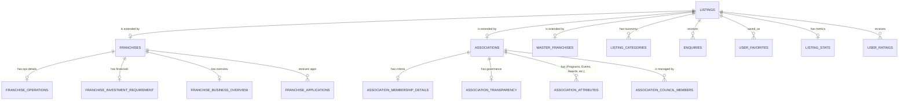

# Schema v2 Documentation

This document explains the transition to the **Class Table Inheritance** pattern for the platform's database schema, migrating away from overloaded tables and unstructured JSON blobs.

## Why Class Table Inheritance?

In the previous schema (`30-schema.sql`), all offerings (Franchises, Associations, Master Franchises) were forced into a single `franchises` table. Because each offering has vastly different fields (e.g., Franchises care about "Space Required", Associations care about "Membership Fees"), the old schema relied on a generic `entity_type` column and stuffed remaining offering-specific data into an `association_metadata` JSONB column.

This led to several problems:
1. **Poor Query Performance:** Searching or filtering inside JSONB is slower and harder to index than standard relational columns.
2. **Schema Inflexibility:** Universal actions like "Enquiries" or "Favorites" pointed to `franchise_id`, which didn't make semantic sense for Associations.
3. **Bloat:** The `franchises` table grew overly wide with columns only relevant to one type of offering.

**The Solution:** The Class Table Inheritance pattern uses a Base Table for all common fields, and distinct Child Tables for offering-specific fields.

---

## Architecture Overview

### 1. Base Table (`listings`)
The `listings` table acts as the central hub. Any entity added to the platform receives an entry here.
- **Common Fields:** `id`, `name`, `slug`, `description`, `entity_type`, `status`, `website_url`, logos, contact info, timestamps.
- **Polymorphic Reference:** All generic features point to `listings(id)`.

### 2. Child Tables
Child tables share the exact same Primary Key (`id`) as the `listings` table. The Primary Key also acts as a Foreign Key with `ON DELETE CASCADE`.

- **`franchises`**: Stores `total_outlets`, `business_type`, `parent_company`, etc. Has further 1-to-1 extensions like `franchise_operations` and `franchise_investment_requirement`.
- **`associations`**: Stores `association_type`, `legal_status`, `member_count`, `membership_fee_min`, etc.
- **`master_franchises`**: Stores `territory_rights`, `master_fee`, etc.

### 3. Structured Data for Associations (No JSON)
To avoid JSON arrays for complex lists visible in the Association UI:
- **`association_membership_details` & `association_transparency`**: 1-to-1 extension tables storing structured checks and governance data.
- **`association_attributes`**: A generic EAV (Entity-Attribute-Value) style table that captures Programs, Publications, Events, Partnerships, Awards, and Policies. This prevents creating 7 nearly identical tables while keeping data fully queryable.
- **`association_council_members`**: A self-referencing hierarchical table to store leadership structures.

### 4. Universal Tables (Renamed)
Tables handling platform-wide features are now prefixed with `listing_` instead of `franchise_`:
- `listing_categories`
- `listing_stats`
- `listing_cities`
- `listing_social_links`
- `listing_documents`

Actions like `enquiries`, `user_ratings`, and `user_favorites` now reference `listing_id`.

---

## Entity-Relationship (ER) Diagram

The following diagram highlights the core relationships between the Base table, Child tables, and universal features.

## Maintenance and Extensibility

If LeMiCi introduces a 4th offering (e.g., `consultants` or `vendors`):
1. Add `'consultant'` to the `entity_type` constraint in `listings`.
2. Create a new `consultants` table referencing `listings(id)`.
3. The new entity immediately inherits Categories, Stats, Enquiries, Favorites, Ratings, and Audit Logs without any further schema changes.
